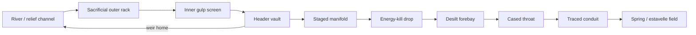

# Gulpgates
### Stage-Gated Karst Intake Architecture
#### *A Variable-Aperture Flood Surplus Article for Traced Carbonate Conduits*

by **Bradford James Focht** (The Architect / Aspenth)    
*v1.0 – v1.3 — August 31st, 2026*

---

## Purpose

This document is an architecture for **Gulpgates**: a shoreline or floodplain article that takes a *measured surplus* off a rising river, parks that slice in a **horizontal header vault**, and hands a capped $Q$ to a *traced* karst conduit in staged gulps rather than one open swallow.

The name is deliberate. A swallow is continuous. A gulp is sized, timed, and stoppable. Different apertures open at different stages so the intake eases into the underground river instead of punching a single jet into unmapped rock. The article fails closed. Capacity is the conduit’s *spare* flood $Q$, not the surface river’s $Q$, and not the receiving spring’s already-used flood $Q$.

The primary failure mode is not “the pipes were too small.” It is **backflood**: the gulp arrives in a conduit that is already full and leaves through an estavelle, a neighbor’s basement, or a spring that was not in the brochure. Design for that first.

**Backflood is not “solved” by a larger gulp.** It is solved by refusal. The rock is never the overflow tank. The header vault is. Projected volume the conduit cannot take stays on the surface: live storage in a scalable vault, then a weir home to the river. Detect early, close the throat, keep the refused pulse out of the karst. That is the closed loop. There is no honest promise of zero backflood. There is a published home for every cubic metre you decline to inject.

This file is an **architecture and campaign document**. It is not a stamped intake, not a bid, and not a permit. In many jurisdictions a river-to-karst connection is a regulated injection (often a Class V well). This file is not that permit. Shaft lining, vault hold-downs, gate actuators, and spring-field instruments are builder outputs after hydrogeology and Campaign K0. A builder who drills a row of pipes from this narrative alone has built a sculpture — and, in karst, a sculpture that can collapse a floodplain or foul a drinking spring.

The architecture is offered as a supporting technical instrument within the [Humai Accord](README.md). It sits next to [Stormcrashers](STORMCRASHERS.md) as a hydrologic sibling: Stormcrashers dissipates coherent kinetic structure in air and nearshore water; Gulpgates meters surplus flood volume into an already-carved conduit. Both follow [*Necessary Entropy*](NECESSARY_ENTROPY.md), [*Why Walk When You Can Ride?*](WHY_WALK_WHEN_YOU_CAN_RIDE.md), [*Empirical Demonstrations*](EMPIRICAL_DEMONSTRATIONS.md), the [Simulation Model of the Exterior Viability Protocol](SIMULATION_EXTERIOR_VIABILITY.md), the **Utilization Integrity Protocol**, and [The Call to Code](THE_CALL_TO_CODE.md). Scale-out follows the same counting doctrine used in the [Regenerative Lattice Core](REGENERATIVE_LATTICE_CORE.md): add sealed kits, do not invent a growable maze.

It is not a claim that limestone will drink a Himalayan debris flood, that caves are empty storage tanks, that extra drainage through soil cover is harmless, or that pipe friction will evaporate a flood. Dual-use pumping, diversion, or aquifer-poisoning modes are excluded. Protective metering only.

All bands below are provisional starting envelopes drawn from published karst engineering, swallow-hole / ponor works, storm-drainage wells, detention vaults, and managed-aquifer-recharge practice in carbonate rock. They are orientation arithmetic. Campaigns K0–K1 exist so those envelopes can be replaced by co-verified measurements.

---

## Scope and Limits

**In scope**
- One parent article: the Gulpgate intake (screened river takeoff, horizontal header vault, staged manifold, energy-killing drop, cased rock connection, fail-closed gate)
- Use only on *documented carbonate karst* with mapped or dye-traced conduits
- Stage-gated apertures so small lines take the first rise and large lines open later
- Horizontal, setback control volume as the overflow manager; vault weir returns home to the river
- Vault live-storage scaled to the K0 *refused* hydrograph, not to the river’s full flood
- Ordinary-flood debris path: sacrificial outer rack, inner gulp screen, rack differential-head trip, abrasion allowance on apron and drop
- Dirty-limb refusal: Alert and later stages stay closed when takeoff water is outside the K0 quality band; refused dirty pulse uses the vault and the river weir
- Siting landward of the bank-migration belt the next ordinary flood will cut
- Campaign K0 (trace, spare capacity, cover, chemistry, legal path) and Campaign K1 (one instrumented prototype)
- Linear counting of intakes on *already-traced* throats
- Array of independent kits on *separate* traced receptors; shared rock is shared remainder
- Passive-closed default; powered open only inside a published stage window
- Optional micro-recovery in the drop under [*Why Walk When You Can Ride?*](WHY_WALK_WHEN_YOU_CAN_RIDE.md)
- Open-build civil and hydrogeologic article using commercially available gates, liners, vaults, and racks

**Out of scope**
- Himalayan ice/rock avalanche and debris-flood paths (including the late-August 2026 Lhende / Bhotekoshi / Trishuli event). Wrong sediment, wrong geology, wrong tool.
- Rows of unlined shoreline pipes soaking through alluvium “into the caves”
- Elevated water towers or flowing-pipe structural legs in the floodway
- Evaporation plates, friction-heat dryers, or “incremental” pipe-wall boilers
- Using the conduit as the overflow tank, or “solving” backflood by opening Survival
- Untraced conduits, speculative maze drilling, or “find a deeper cave” after a failed dye test
- Using a drinking-water karst as a sewer
- Guaranteed flood-stage reduction at a named town; guaranteed zero backflood
- Stopping a closed-depression flood by pouring more water into a swallow hole that is already too small
- A vault so large it is a flood-control dam for the basin (wrong article; people off the floor first)
- Weaponized diversion, aquifer contamination, or dewatering a neighbor’s spring on purpose
- Ghost Glass, Multi-Emitter, or residual-flux work on the shaft
- A bid, stamp, UIC / injection permit, or water-right issued from this file alone
- A synchronized Survival grid, or many intakes booked against one $Q_{\mathrm{spare}}$
- Sky jets, boil loops, paddy-covered modules, or pipe-network lakes used as $V_{\mathrm{live}}$

An intake that cannot fail closed, that stores floodwater in the air on wet legs, that connects through soil cover instead of cased rockhead, or that treats the cave as the overflow tank, is not a Gulpgate article.

---

## Core Design Principles (Humai Alignment)

1. **[*Necessary Entropy*](NECESSARY_ENTROPY.md)** — Aperture steps are deliberate, bounded, and logged. They exist to ease head into a known throat, not to multiply pipes.
2. **Meter, do not dump** — The cave is already a river. Extra peak that exceeds *spare* conduit capacity backfloods somewhere else. Take a surplus slice. Do not offer the whole flood.
3. **Fail closed, overflow home** — Loss of power, loss of heartbeat, or a spring-turbidity / settlement / head-band / estavelle trip drops every gate. Vault surplus returns to the river over a weir. The river stays in its bed. That is the correct degraded mode.
4. **Refuse on the surface** — Projected overflow is a vault-sizing input, not a gulp-sizing input. Scale live storage to the refused pulse. Do not scale the throat to a speculation. A dirty rising limb is also refused on the surface.
5. **Refuse the dirty limb** — The first water of a flood is usually the worst water. Turbidity, hydrocarbons, or a K0 chemistry floor at the *takeoff* close the throat. Quality refusal is not a treatment plant. It is another weir-home.
6. **Traced throat only** — No dye recovery, no article. Time-of-travel and spring identity are first-class data, not folklore. Flood-stage connectivity is not assumed from a low-flow trace.
7. **Cased to rockhead** — New or increased drainage through soil cover is a documented sinkhole trigger. The shaft does not soak. It is a lined drop to competent rock.
8. **Header is not structure** — The gulp pipes do not hold the vault up. Structure is dumb mass. Pipes are replaceable internals. Each throat on a split header can be isolated without feeding the dead one.
9. **Co-verification / dual report** — No “we lowered the flood” claim from a single staff gauge. Public sentences carry intake $Q$ *and* spring-field response in the same window.
10. **[*Why Walk When You Can Ride?*](WHY_WALK_WHEN_YOU_CAN_RIDE.md)** — If head is being killed in the shaft, recover a house-load from that drop. Do not invent a thermal story on wall friction.
11. **Non-domination / [Exterior Viability](EXTERIOR_VIABILITY_PROTOCOL.md)** — Siting stays under local civil authority. An array that exports flood or sewage to the next spring field is a failed siting even if the protected bank looks dry.
12. **Modularity and exit** — One intake can be isolated or retired without opening the others. Scale by counting kits on traced throats, or by enlarging vault live storage against a published refused hydrograph.

---

## Why “Gulp,” and Why Karst at All

Rivers often find soluble beds. Natural swallow holes already steal part of a rising limb. That fact is not a license to industrialize every limestone bank.

Three published facts set the fences:

- Most *new* sinkholes in covered karst are soil-cover failures after extra infiltration or after a later water-table drop removes buoyancy. They are not usually cave-roof collapses under a thick beam of rock.
- Karst conduits transmit with little matrix treatment. Floodwater is sediment, microbes, and whatever the catchment washed. The next spring is a drinking-water event unless the site is not a supply aquifer — or the water is treated as if it were a sewer discharge.
- Closed depressions already flood when inflow exceeds what the throat can pass. Forcing more water at that throat moves the flood underground and then out an estavelle or a neighbor’s basement.

Gulpgates is therefore a **surplus meter on a proven extra path**, not a new soakaway. If K0 cannot show spare flood capacity *and* a non-potable or already-classified receiving path, the site is dead.

Variable setup is the whole point of the name. One large pipe is a swallow. A staged manifold behind a header is a gulp: small, then medium, then a hard-capped large line, each with its own invert and orifice curve.

Pipe friction does heat the water. The rise is $gH/c_p$ — tenths of a kelvin at ordinary heads. That energy is a loss term and, if recovered at all, a shaft generator. It is not an evaporation plate.

### Related practice

This file does not invent river-to-karst works. It refuses the usual failure modes of the ones that already exist.

- **Class V stormwater drainage wells and “improved sinkholes”** are the legal box in many jurisdictions. Built as always-open soakaways they have a published record of cover collapse and spring contamination. Gulpgates is that legal box with the opposite default: closed, capped at spare capacity, refused volume home to the river.
- **Shutoff / bypass drainage wells** (state stormwater manuals) already add a valve when the aquifer is overloaded. The usual product is still recharge kept *in the ground*. Here the bypass is the vault weir back to the channel.
- **Antioch Cave and similar cave-mouth BMPs** gate *quality*: they keep turbid first flush out of a supply aquifer. Gulpgates steals that instinct for the dirty limb, then adds a flood - $Q$ cap those structures were not written to carry.
- **Dinaric polje works** — widened ponors, small floodgates, reservoirs that leak into carbonate — are basin-scale flood-into-karst. Many became grout-curtain projects. Spare-capacity as a kill, and the refused vault, are the bill those sites paid.
- **Cased gravity drains through soil into epikarst** already isolate cover from the gulp. Layer 5 is that rule, not a new geology.
- **Conduit-head switching** during flood pulses is measured behavior (Castleton, Derbyshire, and other instrumented conduit nets): heads rise, inactive routes turn on, springs trade flow. The head-band trip is written against that, not against folklore.

What is assembled here, and not in those cousins as a single public architecture, is flood-stage dye before steel, $Q_{\mathrm{spare}}$ as a budget remainder, $V_{\mathrm{live}}$ sized to the *refused* hydrograph, fail-closed default, dirty-limb refusal at the takeoff, dual-report of intake plus spring plus cover plus estavelle, and an explicit outburst-path refusal.

---

## Backflood Doctrine

Backflood is the article’s first design load. The closed loop is four acts, in order:

| Act | What happens | Where the water is |
|-----|----------------|--------------------|
| Cap | $Q_{\max,\mathrm{intake}} \le 0.2\text{–}0.4\,Q_{\mathrm{spare}}$ | Only spare goes to rock |
| Detect | Conduit-head band, estavelle / spring acceleration, cover settlement, throat-blind | Instruments, not hope |
| Stop | Gates fail closed. Survival cannot open against a running weir plus a high shaft | Throat isolated |
| Home | Refused volume lives in vault storage, then the river weir | Surface only |

**Definitive, in the sense this file will allow:** every cubic metre the K0 hydrograph says the conduit will not take has a sized surface home *before steel*. The cave is not asked to prove it can drink the rest.

**Not definitive, and not claimed:** zero discharge at every estavelle on every future flood. Karst changes. K1 exists so the cap and the vault rating can be cut, not raised by press release.

If the refused volume will not fit a setback vault without becoming a basin dam, this is the wrong article. Move people off the doline floor. Do not pour a bigger gulp.

---

## Parent Article — The Gulpgate Intake

### Role

Sit on a rising river or flood-relief channel in documented carbonate karst. At published stages, pull a measured takeoff into a setback horizontal vault. From that known head, open a staged manifold. Kill the energy in a lined drop. Hand a capped $Q$ to a cased connection into a dyed conduit. Close when the peak passes, when the spring protests, when conduit head leaves its band, when an estavelle speaks, or when the cover moves. Anything the vault cannot hand to the throat goes home over the river weir.

### Stack (typical)

Flow is top to bottom: river first, instruments last. Nothing in this stack is a row of pipes stabbed through the live bank into dirt, and nothing in this stack is a water tower on flowing legs.

| Order | Element | Job |
|-------|---------|-----|
| 1 | River or relief channel | Source of the rising limb only. Ambient low flow stays in the bed. |
| 2 | Screened takeoff, trash rack, scour apron | Pull surplus off the channel without eating the bank. |
| 3 | Horizontal header vault | Detention, known head, and the *refused-volume* home. Overflow weir back to the river. Not an elevated tank. |
| 4 | Staged weir / orifice manifold | Small, then medium, then large. This is the gulp. Fed from the vault, not from raw river stage. |
| 5 | Stilling basin or vortex drop in a lined shaft | Kill head so the throat is not a cutting jet. Optional house-load recovery here. |
| 6 | Desilt forebay | Machine-accessible after the event. Holds the flood sediment, not the pretty dry-season load. |
| 7 | Cased borehole or short adit | Through cover to rockhead, then into the traced throat. Not a structural pylon. Isolable per throat. |
| 8 | Spring-field, estavelle, and cover-field instruments | Not optional. Receptors are part of the article. |

Surplus the throat will not take never leaves the vault except over the weir. Dirty-limb water uses that same weir.

### Layer 1 — Takeoff

- Set back from the actively eroding bank on a scour-protected apron. Vault, casing, and apron land **landward of the bank-migration belt** the next ordinary flood will cut. If K0 cannot name that belt, the takeoff is too close.
- **Two-stage rack.** Coarse sacrificial outer rack takes wood, ice cakes, and urban trash. Fine inner rack is the gulp screen. Outer rack is a replaceable wear part after every flood, not a structural member. First-article placeholder: outer $100\text{–}300\,\mathrm{mm}$ bar spacing; inner $50\text{–}150\,\mathrm{mm}$. Site output after the first debris season.
- **Rack differential-head trip.** Instruments across the outer rack. When $\Delta h$ leaves the K0 band (screen blinded), gates fail closed. Do not wait for a full forebay. A blinded rack is not a reason to open Survival.
- Invert above ordinary low flow so ambient river stays in the bed (ambient = nothing open).
- **Dirty-limb tap.** Takeoff turbidity (and a hydrocarbon / specific-conductance screen if the catchment warrants it) is a gate input, not a spring-only afterthought. When the takeoff sample is outside the K0 dirty-limb band, Alert does not open. The pulse stays in the vault and leaves over the weir. This is not a treatment plant.
- Apron carries an **abrasion allowance**: sacrificial slab or lining designed to be recast, not a single-life architectural face. No slender members in the current (flowing-pipe legs remain out of article).
- No unlined ditch into a doline. If the site only works as a soakaway, it is not a Gulpgate site.

This is ordinary carbonate-river flood debris: wood, silt, trash, ice cakes. It is not a Himalayan ice–rock outburst or boulder front. Those paths stay out of scope. A thicker rack does not make this article a debris-flow bunker.

### Layer 2 — Horizontal header vault

This is the connecting control volume and the backflood home. It is a squat tank or buried box, not a tower.

**Why it is here.** River stage is a noisy head. A vault gives the manifold a published water surface, a debris-settling minute, and a weir that fails home to the river instead of into the rock. It also splits one takeoff toward more than one traced throat later, without a second bank cut. Most important: it is the only legal overflow tank in the article.

**Live storage (orientation).** Size the vault to the *refused* pulse from K0, not to the river and not to a hoped-for gulp:

$$
V_{\mathrm{live}} \ge k \int_{t_0}^{t_1} \max\!\left(0,\, Q_{\mathrm{in}}(t) - Q_{\mathrm{gulp,cap}}(t)\right)\,dt
$$

with $k = 1.2\text{–}1.5$ until K1 replaces it, and $(t_0,t_1)$ the design pulse on the K0 hydrograph (Alert-to-Flood window, typically tens of minutes to a few hours — a site output). A short-pulse check used in the worked arithmetic is $V \approx Q_{\mathrm{Alert}}\Delta t$ only when $Q_{\mathrm{gulp,cap}}$ is treated as zero for that slice (worst refusal).

**Scalability.** Yes: once K0 speculates a regional refused volume, live storage scales as a published multiple of that integral. Scale the *vault*, or count additional vault kits on the terrace. Do not scale $Q_{\mathrm{gulp,cap}}$ to make the integral look small. If $V_{\mathrm{live}}$ requires a dam, a levee lake, or occupation of the floodway as a reservoir, stop. That volume is a different article, or a decision that this bank is not a Gulpgate site.

**Geometry (orientation, not a stamp).**
- Set on the terrace or a scour-protected pad *behind* Layer 1, landward of the K0 bank-migration belt, not in the live floodway if a terrace exists.
- Horizontal plan. Buried or bermed preferred. Hold-downs for buoyancy when empty.
- Overflow weir: wide, high, home to the channel. Weir $Q$ at vault-full must exceed takeoff $Q$. The vault is allowed to overtop; the karst is not.
- Structure is concrete or equivalent mass. Gulp pipes run *inside or beside* the stems. Pipes are not the columns. Four-to-eight wet legs holding an elevated tank are out of article.

**Operating rule.** Vault level is a control input to the manifold, not a trophy. If vault level says the throat is not taking water and the weir is running, that is success of the fail path, not a reason to open Survival.

### Layer 3 — Staged manifold (the gulp)

Diameters and inverts set head–discharge curves from the *vault surface*, not from a mystical pressure gradient and not from raw river stage. Until K0 supplies a measured rating curve, use the orifice form as orientation only:

$$
Q = C_d A \sqrt{2gH}
$$

| Stage | What opens | Intent |
|-------|------------|--------|
| Ambient | Nothing | Default. River in its bed. Vault empty or isolated. |
| Alert | Small high weir or small orifice | First gulp of the rising limb, *if* takeoff water is inside the K0 dirty-limb band. Low $Q$. |
| Flood | Medium laterals | Adds capacity without taking the section. Still below the spare-capacity cap. |
| Survival | Large gated line, hard $Q_{\max}$ | Cap at a fraction of *spare* conduit capacity. Never “all open, no cap.” |

Stagger invert elevations so the small lines run first and the large line only sees head after they are already flowing. That is the eased gulp.

**Optional Alert path — air-admit siphon.** One small Alert line may be a siphon with a vacuum break at a published deck elevation. It runs with no power and dies when air is admitted or the deck is drowned. It is not the Flood or Survival stack. It will not hold a throat open against a running weir.

**Spare-capacity method (K0-Q, boxed).** $Q_{\mathrm{spare}}$ is a budget remainder, not a gauge nailed to the spring.

$$
Q_{\mathrm{spare}} = Q_{\mathrm{safe,max}} - Q_{\mathrm{already}}
$$

Estimate the two terms from the same flood-relevant window:

1. Gauge the dyed spring *set* through at least one rising limb. Prefer a flood-stage window. Low-flow-only is a study.
2. Subtract other inputs to that set that K0 can name (ungauged tributaries, other traces, overland that never entered this conduit). What remains is $Q_{\mathrm{path}}(t)$ — discharge already using this path.
3. $Q_{\mathrm{already}}$ is $Q_{\mathrm{path}}$ at the design flood *without* the intake.
4. $Q_{\mathrm{safe,max}}$ is the highest $Q_{\mathrm{path}}$ K0 can defend without estavelle blow, cover distress, or spring-field floors leaving their envelope — historical if it exists, otherwise a hydraulic estimate of the throat stamped as provisional.
5. If the historical peak already blew an estavelle or distressed cover, $Q_{\mathrm{spare}} \approx 0$ and the site is dead.
6. Dye recovery fraction at that stage is a connectivity check, not a flowmeter. Do not treat “80 % recovered” as “80 % spare.”

If either term cannot be bounded, there is no first article. Do not substitute receiving-spring flood $Q$ for $Q_{\mathrm{spare}}$.

**Phase window (K0-H polarity).** Level is not enough. Estavelles reverse. Alert and later stages open only while the receiving spring or estavelle is still *accepting* (falling or steady-out) in the same window the river is rising. If the receptor limb turns around, that *is* the backflood signal: Survival stays locked. If K0 shows the river crest and the receptor crest in phase, $Q_{\mathrm{spare}}$ for that window is treated as zero. Most intakes are “river high → open.” A Gulpgate is “river high *and* receptor still accepting.”

**First-article $Q_{\max}$ placeholder.** Until K1 exists:

$$
Q_{\max,\mathrm{intake}} \le 0.2\text{–}0.4\,Q_{\mathrm{spare}}
$$

A spring at $20\,\mathrm{m}^{3}\,\mathrm{s}^{-1}$ with no spare is a site, not an intake.

### Layer 4 — Energy kill, optional recovery, sediment

A jet into limestone is a cutting tool. Kill $H$ in the shaft:

- Vortex drop, helical wall-cling, stepped cascade, or stilling basin before the rock throat. A spiral here is an energy-kill geometry, not a heater. Drop walls and the energy-kill floor carry the same abrasion allowance as the apron: a sacrificial lining or recastable thickness, not a hope that first-article steel lasts the life of the site.
- Optional house-load turbine or recovered drop generator under [*Why Walk When You Can Ride?*](WHY_WALK_WHEN_YOU_CAN_RIDE.md). Duty: gates, instruments, trip batteries. Not a thermal evaporator. Friction $\Delta T \approx gH/c_p$ stays a loss term.
- Optional weir-home runner, ram, or trompe may charge the fail-close store or a house battery. Duty is the closer and the instruments. The array and the solar park do not command a gate.
- Forebay that a machine can muck after the flood. Design for the *flood* sediment load, not the pretty dry-season river.
- If the forebay blinds, the gates close. Do not blow sediment into the conduit to “keep up.”

### Layer 5 — Rock connection

- Cased through alluvium and epikarst to competent rockhead.
- Connection only into a throat that K0 has dyed to a known spring set *at a stage comparable to the intended gulp*.
- No “we’ll find the cave from the bit.”
- Access for inspection and for closing the throat if the conduit misbehaves.
- Conduit-head band: shaft and near-field well levels stay inside a K0-published envelope. Leaving the band is a hard trip. Pressurizing a cover-void is a failed gulp. The band exists because flood pulses in traced conduit nets raise heads by metres and switch which routes run (instrumented behavior at Castleton and elsewhere). Design against that switching, not against a static cave.
- Split headers: each throat has its own gate. A blind or high-head throat is isolated. The vault does not keep feeding it. Surplus goes to the weir, not to the dead sibling.

### Layer 6 — Gate and fail-safe

- Gravity-close or stored-energy close on loss of power. **Prefer event-charged close:** the rising river or the weir-home charges a weight pocket, a hydraulic ram, or a trompe (falling-water air bottle) so the same limb that wanted in has already cocked the closer. Grid and diesel are backups, not the safety case. The event does not get a vote to keep the throat open.
- Hard trips:
  - takeoff water outside the K0 dirty-limb band
  - spring turbidity above the K0 band
  - cover settlement above the K0 band
  - shaft / conduit head outside the K0 band
  - estavelle stage rising on the dyed path faster than the dual-report can account for with intake $Q$
  - intake $Q$ approaching $Q_{\max}$
  - vault-weir running while Survival is asked to open
  - forebay blind
  - outer-rack $\Delta h$ outside the K0 band
  - on a split header, throat-B head or blind while vault still has level
  - receptor polarity reversed (estavelle or spring limb turning around while the river is still rising)
- Construction / service mode: gates locked closed.
- No cloud vote required for the trip.
- Vault overflow is not a trip. It is the intended surplus path.

### Layer 7 — Sensing (minimum viable)

- Takeoff stage and $Q$
- Takeoff turbidity (and hydrocarbon / conductance screen where K0-W requires it)
- Outer-rack $\Delta h$
- Vault level and weir $Q$ (or weir flag)
- River stage upstream and downstream of the takeoff
- Shaft water level / conduit-head proxy, per throat on a split header
- Receiving-spring $Q$, stage, turbidity, specific conductance, and a basic chemistry suite
- Estavelle / closed-depression stage on the dyed path
- Cover-field settlement (survey nails, inclinometer, or fiber) on the floodplain and over the mapped void
- At least one independent far-field well or spring outside the intended path

**Dual-report rule.** A public “we took the peak off” sentence names, in the same window: intake $Q$ (and vault-weir $Q$ if the weir ran) *and* whether the dirty-limb trip ran *and* spring-field $Q$ / stage / turbidity *and* cover settlement versus the K0 floors *and* conduit-head / estavelle status. One staff gauge is not a demonstration.

---

## Bill of Materials and Substitution Grades

Orientation only. Stamped specs are builder outputs.

| Element | First-article grade | Acceptable substitute | Do not |
|---------|---------------------|----------------------|--------|
| Header vault | Reinforced concrete box, buoyancy hold-downs, weir width from $V_{\mathrm{live}}$ | Buried precast modules added as counted kits to the same weir rating | Elevated tank on wet pipe-legs; a dam called a vault |
| Takeoff rack | Two-stage: sacrificial outer (replaceable), duplex or 316 inner gulp screen; $\Delta h$ taps | Coated carbon steel outer only in short-life / freshwater trials | Light galvanized farm gate; one rack doing both jobs; structural use of the outer rack |
| Apron / drop lining | Sacrificial concrete or lined wear course, recastable | Equivalent abrasion allowance in a stamped spec | Architectural face with no wear thickness |
| Header internals | Replaceable HDPE or lined steel laterals | Ductile iron where abrasion allows | Structural use of the laterals |
| Drop shaft | Lined concrete vortex or helical cling | Lined steel can in competent ground | Bare soil or epikarst walls |
| Rock casing | Steel or HDPE casing through cover to rockhead, grouted annulus | Equivalent water-well casing practice | Open hole through soil cover |
| Gates | Gravity-close sluice or flap with stored-energy assist; one gate per throat | Redundant hydraulic with fail-close accumulators | Motor-open, motor-close, no stored close; one gate for two throats |
| Forebay | Machine-accessible concrete sump | Lined excavated cell with access ramp | “The cave will take the silt” |
| Instruments | Gauged $Q$, turbidity, conductance, survey nails, estavelle staff | Add fiber or inclinometer on thin cover | Phone photos of a stick |

Cost driver is river works, the rock connection, and a *flood-stage* K0 trace — not the pipe stickers. Wet-face alloys and hold-downs are line items, not surprises inside a prototype band.

---

## Campaign K0 — Trace, Spare Capacity, Cover, Chemistry, Path

Purpose: decide whether a throat may be offered a gulp at all, and how large the *surface* home for refused volume must be. **Required before steel.**

| Item | What is collected | Pass / fail notes |
|------|-------------------|-------------------|
| K0-T Trace | Dye or approved tracer at the proposed connection. Recover at every spring, well, and estavelle in the plausible basin. Mass, detection limit, and chain-of-custody logged. | No recovery = dead site. Recovery in a municipal or domestic well = dead site unless a separate treatment article exists (it does not, in this file). Low-flow-only trace = study, not an article. Prefer a rising-limb or flood-stage trace. Flood-stage dye is the K0 schedule and cost driver. |
| K0-Q Spare capacity | Apply the boxed method in Layer 3. Bound $Q_{\mathrm{safe,max}}$ and $Q_{\mathrm{already}}$ in the same flood-relevant window. | If $Q_{\mathrm{spare}}$ cannot be bounded, no first article. Do not use spring flood $Q$ as a proxy for spare. Historical estavelle blow at the peak $\Rightarrow$ $Q_{\mathrm{spare}} \approx 0$. |
| K0-R Refused hydrograph | $Q_{\mathrm{in}}(t)$ at the takeoff vs $Q_{\mathrm{gulp,cap}}(t)$. Integrate the positive remainder. | This integral *is* $V_{\mathrm{live}}/k$. No hydrograph, no vault size, no steel. Speculation without a gauged rising limb is not K0-R. |
| K0-C Cover / rockhead | Thickness $t$, mapped void span $L$, void indications (gravity / ERT / borehole as the site allows). | Orientation screen (not a stamp): $t/L < 1$, or thin cover over a void the gulp would pressurize, is a kill pending a local geotech stamp that says otherwise. No stamp, no footprint. |
| K0-H Head band | Dry-season low and flood high in shaft-proxy wells. Estavelle behavior on the dyed path. | Publish the conduit-head envelope the gulp may not leave. Later drawdown-collapse risk is a failed siting. |
| K0-E Phase window | Simultaneous river-rising and receptor-falling (or steady-out) records on the dyed path. Estavelle polarity through at least one real rising limb. | In-phase crests in the design window $\Rightarrow$ $Q_{\mathrm{spare}} \approx 0$ for that window. No polarity record = study, not an article. |
| K0-W Floodwater quality | Sediment, microbes, nutrients, hydrocarbons if the catchment has them — at *high stage*, not a dry-season grab. Calcite saturation index SI and $p\mathrm{CO}_2$ on that sample. Publish a **dirty-limb band** for takeoff turbidity (and hydrocarbons / conductance if the catchment warrants it). | Potable receiving path + untreated floodwater = dead site. $\mathrm{SI} < 0$: log as aggressive; do not raise $Q_{\max}$ on the hope that the throat will enlarge. $\mathrm{SI}$ is a watch item, not a capacity credit. Water outside the dirty-limb band is refused to the weir; it is not a gulp. |
| K0-P Receiving-path class | Written class: non-potable conduit / already-classified waste path / potable / prohibited. Water-right and wellhead-protection review. UIC / injection status in that jurisdiction. | Potable or prohibited = no steel. This file is not the permit. |
| K0-S Collapse-watch baseline | Survey nails / inclinometer / fiber in the ground *before* first water. Far-field control point. Estavelle staffs in before first water. | No baseline = no K1. |

**Pass criterion (provisional).** 
- A named throat
- a named spring set
- a *flood-relevant* trace
- a bounded $Q_{\mathrm{spare}}$
- a refused-hydrograph integral that fits a setback vault
- cover that survives the $t/L$ screen or a stamped exception
- a published head band
- a published dirty-limb band at the takeoff
- a published phase window (K0-E)
- and a receiving-path class that is not potable or prohibited.

Anything less is a study, not an article.

---

## Campaign K1 — One Instrumented Intake

Built only after K0 close-out, on a relief channel or secondary bank — not as the last defense of a dense town on the first try.

**Success (provisional).**
- Gates follow the stage table and fail closed on a pulled-power test.
- Vault weir runs home to the river when asked; Survival does not open against a running weir plus a high shaft.
- Intake $Q$ stays inside the K0 cap through one real flood.
- Refused volume stayed in $V_{\mathrm{live}}$ or left over the weir. None of it was “solved” by opening a throat against a trip.
- Dual-report packet exists: intake $Q$, vault-weir $Q$, river-stage delta, spring $Q$ / turbidity / conductance, cover settlement, conduit-head proxy, estavelle staffs.
- River-stage relief, if any, is co-verified and modest. Do not advertise a town saved from a single K1.
- Receiving spring stays inside the K0 envelope.
- Cover settlement stays inside the K0 envelope.
- Conduit head stays inside the K0 band. Estavelles on the dyed path do not blow as a geyser attributed to the gulp.
- Forebay can be mucked without opening the throat to raw sediment.
- Outer rack can be pulled and replaced without opening the throat. $\Delta h$ trip closes the gates in a pulled-tap test.
- Dirty-limb trip closes Alert against a simulated out-of-band takeoff sample. Refused water leaves over the weir, not through a throat.
- On a split header, a simulated dead throat isolates without feeding the sibling.

Only after K1 does anyone discuss a second intake on the same traced system, a larger $V_{\mathrm{live}}$ kit, or a line of kits on separate traced throats.

---

## Array Doctrine and Scalability

Peak shaving is an array property only after each throat is known. Overflow management is a *vault* property sized from K0-R. A large event is handled as a **sum of independent remainders**, not as a bigger gulp.

| Pattern | Units | Intended product | Notes |
|---------|-------|------------------|-------|
| Point | 1 | K1 instrument + one gulp | First article. Do not sell basin-scale drainage. |
| Vault scale | 1 throat, larger $V_{\mathrm{live}}$ | Same gulp cap, more refused-pulse home | Legal scale-out of overflow. Not a license to raise $Q_{\max}$. |
| Header split | 1 vault, 2 throats | Shared takeoff, separate traced throats | Each throat isolable. Dead throat $\Rightarrow$ weir, not sibling. Only if K0 shows the throats do not fight. |
| Parallel kits | 2–4 | Shared river, separate traced throats | Separate vaults or a sized header. Still fail-closed per kit. |
| River array | many | Staggered refusal along a stem | Many K0s, many receptors. The belt is the river-plus-weirs. The cave is never the belt. |

**Shared rock is shared remainder.** Ten intakes booked against one $Q_{\mathrm{spare}}$ are one intake with nine lies. If two sites can dye to the same spring set, they split one budget in writing before either manifold is cut.

**Do not synchronize Survival.** A grid that opens every last stage at once is how you write a new flood underground. In a large event the array’s job is staggered refusal: most of the crest never left the channel. The gulps are peak-shave. The weirs are the mitigation.

**What “disaster-scale” is allowed to mean.** Useful is shaving dangerous hours on tributaries and upper mainstems where K0 is real, so a downstream peak arrives lower and later. Not useful is promising to park a basin-scale flood in rock. If a region has $N$ documented spare budgets, the array cap is $\sum Q_{\max,i}$ — disaster-relevant on a tributary, often invisible on a continental stem. Publish that sum. Do not invent the stem.

Do not space intakes like Stormcrasher towers. Spacing is a hydrogeologic output: throat identity, phase window, and spring interference — not a $2H$ rule.

A line of ten untraced pipes is not scale-out. It is a sinkhole machine. A vault that has become a dam is not scale-out. It is a different article. A synchronized Survival grid is not scale-out. It is the failure mode with more gates.

---

## Assembly Sequence

1. K0 close-out in writing, including receiving-path class, UIC / water-right status, $Q_{\mathrm{spare}}$ budget, and $V_{\mathrm{live}}$ from the refused hydrograph.
2. Collapse-watch and estavelle instruments in the ground.
3. Scour pad and takeoff rack (gates locked closed).
4. Header vault and river-home weir to the K0 $V_{\mathrm{live}}$. Prove buoyancy hold-downs dry.
5. Manifold and drop shaft. Prove stored-energy close on the bench, then in place. Prove per-throat isolation on a split header.
6. Cased connection to rockhead. No gulp until the annulus is grouted and the throat is the K0 throat.
7. Forebay access and muck path.
8. Dry commissioning: power-pull, takeoff dirty-limb trip, spring turbidity-trip simulation, head-band trip, estavelle-trip simulation, rack $\Delta h$ trip, weir-running lockout of Survival, dead-throat isolation.
9. First water is an Alert-only window with the dual-report packet armed.
10. K1 flood window only after Alert behaves.

A builder who skips to step 6 from this narrative has not implemented Gulpgates.

---

## Instrumentation, Calibration, and Co-verification

**Minimum suite.** Intake and vault level ($0.01\,\mathrm{m}$ class or better at the weir), intake $Q$ by rated structure or meter, river staffs up and down, shaft level per throat, spring $Q$ and stage, turbidity and specific conductance at the spring, estavelle staffs on the dyed path, cover survey to a stated closure, one far-field control.

**Calibration.** Rating curves current before K1. Turbidity and conductance against manufacturer or secondary-standard protocol. Survey loop closed. Dye-house chain-of-custody in the K0 packet, not a folklore bottle.

**Co-verification.** Three families must agree in the K1 window: hydraulic (intake / vault / river), receptor (spring chemistry, $Q$, estavelles), and ground (cover + conduit-head). Two of three is a study note. One of three is a press release, not a demonstration.

---

## Wear-part and O&M floors

Orientation only. Stamped intervals are builder outputs.

| Part | After every flood | Seasonal / annual | Recast / replace trigger |
|------|-------------------|-------------------|--------------------------|
| Outer rack | Pull, inspect, replace bent bars. Log debris class. | Ice-season lock if the rack will ice into a dam | Bent, missing, or $\Delta h$ taps dead |
| Inner gulp screen | Inspect from the vault side | Same | Torn or permanently blinded |
| Apron / drop lining | Visual wear after the event | Survey thickness on the K0 grid | Remaining sacrificial thickness below the stamped allowance |
| $\Delta h$ taps and dirty-limb probes | Confirm they still trip | Calibrate to manufacturer or secondary-standard protocol before the flood season | Failed trip in a pulled-tap test |
| Forebay | Muck before the next Alert window | — | Access blocked |
| Gates / stored-energy close | Cycle after the event | Power-pull before the season | Close-time outside the stamped band |

A site that cannot pull the outer rack without opening a throat has not implemented Layer 1.

---

## Safety Envelopes

- **Collapse.** Extra infiltration through cover is a hazard. Casing to rockhead and the K0 $t/L$ screen are part of the envelope.
- **Backflood.** Estavelles and closed depressions on the dyed path are receptors. If they take the gulp as a geyser, K1 fails. The vault, not the cave, holds the refused pulse.
- **Head.** Conduit-head band is a hard trip. The vault may be full. The rock may not be over-pressured.
- **People.** No occupied shaft in flood mode. Intake deck lockout when river stage is inside the Survival window.
- **Water quality.** Untreated floodwater into a potable karst is out of scope. Write the receiving-path class on the gate cabinet. $\mathrm{SI} < 0$ is a watch, not a capacity credit. Dirty-limb water at the takeoff is a hard trip, not a spring-only apology.
- **Buoyancy and scour.** Empty vault hold-downs and the takeoff apron are flood structure, not landscaping.
- **Debris (ordinary flood).** Sacrificial outer rack, inner gulp screen, $\Delta h$ trip, recastable apron and drop. Multi-leg jackets in the floodway are out of article. One blunt vault body, set back, landward of the migration belt.
- **Debris (outburst / boulder front).** Out of scope. Himalayan ice–rock avalanche and debris-flood paths remain a different article or no article. Do not “up-armor” a Gulpgate and call it Rasuwa-proof.
- **Split throats.** A dead throat is isolated. The header does not become a cross-feed.
- **Cyber.** Authenticated command path; local fail-closed does not wait for a network.
- **Utilization.** Protective metering only, under the **Utilization Integrity Protocol**. No residual-flux or somatic experiment rides on this shaft. No evaporation-plate retrofit as a flood “solution.”

---

## Cost and Logistics Bands

Orientation only. Not a bid.

| Stage | What is being bought | Order-of-magnitude note |
|-------|----------------------|-------------------------|
| K0 | Dye *at flood stage*, gauging, geophysics, water-quality, legal path / UIC review, refused-hydrograph integral | This is the schedule and cost driver. A dry-season fluorescein weekend is not K0. |
| K1 | Setback vault to $V_{\mathrm{live}}$, manifold, gates, drop, cased rock connection, instruments | Dominated by river works, hold-downs, vault volume, and the rock connection, not by pipe stickers |
| Vault scale | More live storage against a new K0-R | Legal overflow scale-out. Still not a dam. |
| Counted kits | More intakes on already-traced throats | Do not copy K1 onto an untraced bank and call it replication |

Insurance and flood-map credits are negotiated after a measured gulp exists.

---

## First Campaigns and Designer-to-Builder Transfer

Under [The Call to Code](THE_CALL_TO_CODE.md), the architecture layer stops here. Builders implement.

**Transfer package**
1. This file, version-locked.
2. K0 raw trace (stage of injection), spare-capacity budget (both terms), refused-hydrograph integral and $V_{\mathrm{live}}$, cover $t/L$, chemistry including SI, head band, and the written receiving-path class plus permit status.
3. Stamped geotech and structural calculations (builder-produced; not in the Accord repo). Vault buoyancy, apron scour and abrasion allowance, bank-migration belt, and vault-as-not-a-dam are in that stamp.
4. As-built invert table, orifice plate list, vault-weir rating, per-throat isolation test, and outer-rack replacement procedure.
5. Commissioning trip-log (power-pull, dirty-limb, spring turbidity, settlement, head-band, estavelle, rack $\Delta h$, weir-running Survival lockout, dead-throat isolation). Wear-part O&M sheet.
6. Public dual-report extract under [*Empirical Demonstrations*](EMPIRICAL_DEMONSTRATIONS.md): peak taken *and* spring / cover / head / estavelle floors held *and* refused volume accounted on the surface.

A builder who skips K0 and drills from this narrative alone has not implemented Gulpgates.

---

## Worked Orientation Arithmetic

Not a rating. A check that the gulp and the vault are dimensionally sane.

**Orifice slice.** $C_d \approx 0.6$, $A = 0.20\,\mathrm{m}^{2}$, $H = 2\,\mathrm{m}$ from the vault surface:

$$
Q \approx 0.6 \times 0.20 \times \sqrt{2 \times 9.81 \times 2} \approx 0.75\,\mathrm{m}^{3}\,\mathrm{s}^{-1}
$$

That is a small Alert line. A Survival line is a multiple of this *only* if $Q_{\mathrm{spare}}$ allows it. Three such slices do not equal “the river disappeared.”

**Cap against spare, not against the spring.** If the receiving spring’s flood $Q$ is $20\,\mathrm{m}^{3}\,\mathrm{s}^{-1}$ and K0 bounds $Q_{\mathrm{already}} = 17\,\mathrm{m}^{3}\,\mathrm{s}^{-1}$, then $Q_{\mathrm{spare}} \approx 3\,\mathrm{m}^{3}\,\mathrm{s}^{-1}$. A $0.3$ cap is about $0.9\,\mathrm{m}^{3}\,\mathrm{s}^{-1}$ for the whole intake. Design the manifold to that number. Do not design the manifold to bankfull of the surface river, and do not design it to $0.3 \times 20$.

**Refused vault.** Takeoff $Q_{\mathrm{in}} = 3.0\,\mathrm{m}^{3}\,\mathrm{s}^{-1}$ for $\Delta t = 20\,\mathrm{min}$, gulp cap $0.9\,\mathrm{m}^{3}\,\mathrm{s}^{-1}$, $k = 1.3$:

$$
V_{\mathrm{live}} \ge 1.3 \times (3.0 - 0.9) \times 1200 \approx 3300\,\mathrm{m}^{3}
$$

That is a setback box, not a tower and not a basin dam. If K0-R returns tens of millions of cubic metres, this bank is not a Gulpgate site.

**Friction heat (why it is not in the article).** $\Delta T \approx gH/c_p$. At $H = 10\,\mathrm{m}$, $\Delta T \approx 0.023\,\mathrm{K}$. Power available if that head is taken as work: $P = \rho g Q H$. For the Alert slice at $10\,\mathrm{m}$, $P \approx 74\,\mathrm{kW}$ — a house-load in the shaft, not an evaporation deck.

**Vault weir.** Vault-full weir $Q$ must exceed takeoff $Q$. If it does not, the vault is a second dam.

---

## Environmental and Siting Parameters

- Carbonate karst with a traced throat. Not till, not Himalayan debris, not an unmapped limestone rumor.
- People off the floor of closed depressions remain the first flood measure. A Gulpgate does not make a doline house wise.
- Aquatic cave life and spring biota are receptors. Turbidity and chemistry floors are part of K1 success, not decoration.
- Public realm: publish the dual-report logs.
- Regulatory: treat river-to-karst as an injection until the local authority says otherwise. CC BY is not a UIC permit.
- Exterior viability: drying one bank by fouling a wellfield or geysering a neighbor is a failed siting. Read the local-global rule in the [Exterior Viability](SIMULATION_EXTERIOR_VIABILITY.md) model before a multi-kit permit.

---

## Naming and Family Position

**Gulpgates** is the family name.  
**Stage-Gated Karst Intake Architecture** is the serious handle if the family name is too loud for a given page.  
**Gulpgate Intake** is the parent article.  
**Header vault** is the connecting horizontal control volume and the refused-volume home. It is not a water tower. 
**Scale-out** is counting independent K0 remainders along a river, not stacking Survival on one throat.

Stormcrashers remains the air / nearshore-wave sibling. ATMA, MAMG, wildfire/ember, and Arctic ice-collar stay on the Stormcrashers horizon list.

---

## License

Text and figures of this document are released under [Creative Commons Attribution 4.0 International](https://creativecommons.org/licenses/by/4.0/). Implementation is invited under [The Call to Code](THE_CALL_TO_CODE.md). Protective-metering intent is further bound by the **Utilization Integrity Protocol**.

This license covers the architectural description. It does not grant rights in third-party standards, mill data, or anyone else’s patents on specific gates, liners, or tracers. Builders remain responsible for permits, water-rights, wellhead protection, UIC / injection status, and structural stamps in their jurisdiction.

No warranty of merchantability, fitness, flood-stage reduction, spring purity, or zero backflood is offered. The first honest product of a Gulpgate is a measured gulp that the spring field can live with, and a measured refusal that stayed on the surface.
