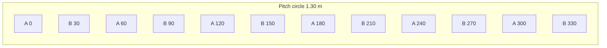
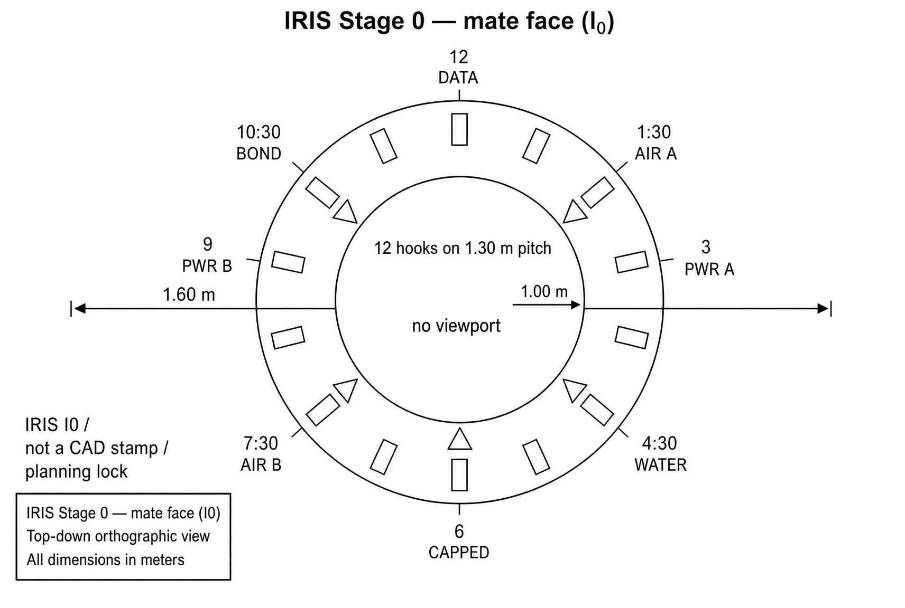
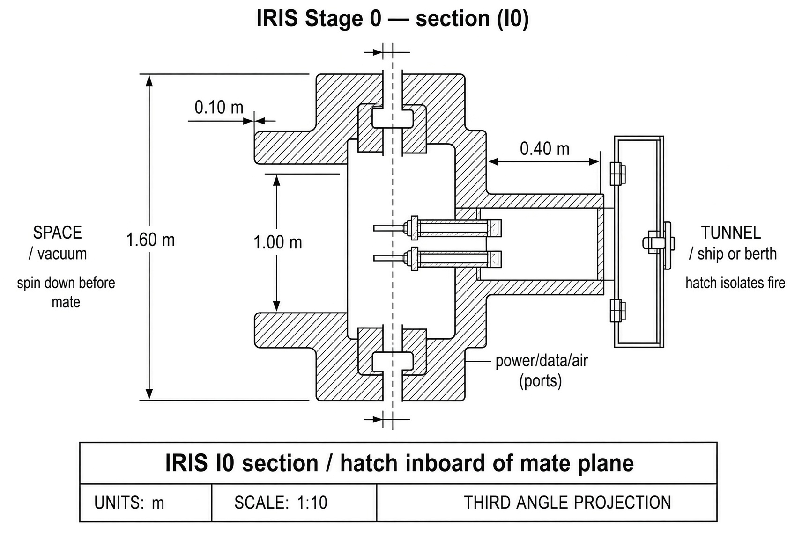
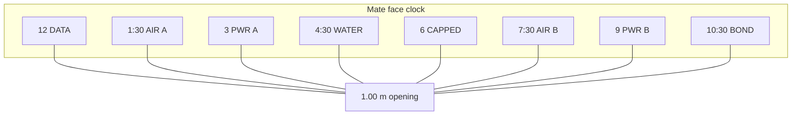
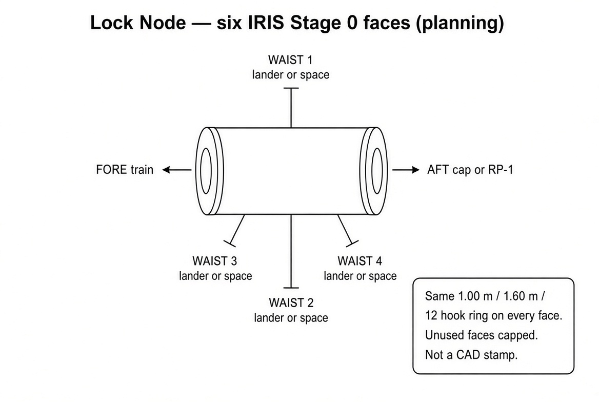
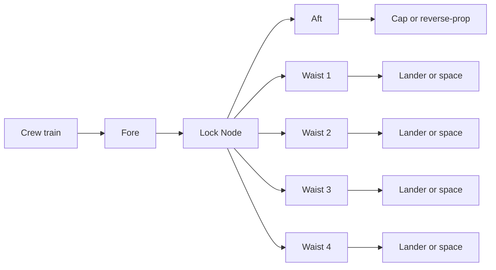

# IRIS
### Magnetic Iris Docking System
#### *One ring type for Enterprise and Space Dock — locked first, moving iris later*

---

by **Bradford James Focht (The Architect / Aspenth)**  
*v0.1 — May 9th, 2026*  
*v1.0 — September 25th, 2026*  
*v1.1 - v1.7 — September 26th, 2026*  
*v1.8 - v1.10 — September 27th, 2026*  
  
---

## Purpose

This document describes **IRIS**: a docking ring for [Enterprise](ENTERPRISE.md) module joints and [Space Dock](SPACE_DOCK.md) berths. The same ring type is used on ships, yard cans, tankers, and later ore haulers. Yard cans use a shorter stack of that same ring. There is no third connector.

IRIS is the shared coupler for **second-generation** trains and yards. First-generation Starship-class ships already move mass and people between worlds. This ring is for the layer after that: many berths, many cars, one opening size a colony boom can copy at Earth, the Moon, and Mars. It is not a first-generation nose cone and it is not a third connector “just for the dock.”

The long-term idea is an eight-blade iris that can change opening size, ride on magnetic guides, and use a magnetic-fluid seal. That idea started as a stadium roof and was rewritten as a port in May 2026.

The first article is simpler. **Stage 0** is a latched ring with one published opening. Blades, if present, are locked. Load goes through the ring and latches. If power dies, the port stays latched. Moving blades, magnetic levitation, and ferrofluid are later stages. They are added only after campaign I1–I4 passes.

This file is an architecture and campaign document. It is not a flight stamp and not a patent application. **I0** below locks the first-article numbers so Space Dock D0-B and Enterprise remate hardware can close. A builder who machines a ring from the narrative alone, without I0 drawings, has not built IRIS.

It is a supporting technical instrument within the [Humai Accord](README.md). It follows [*Necessary Entropy*](NECESSARY_ENTROPY.md), [*Why Walk When You Can Ride?*](WHY_WALK_WHEN_YOU_CAN_RIDE.md), the **[Utilization Integrity Protocol](UTILIZATION_INTEGRITY_PROTOCOL.md)**, the **[Exterior Viability Protocol](EXTERIOR_VIABILITY_PROTOCOL.md)**, the **[Structured Transition Protocol](STRUCTURED_TRANSITION_PROTOCOL.md)**, the **[Agency Interface Protocol](AGENCY_INTERFACE_PROTOCOL.md)**, and [The Call to Code](THE_CALL_TO_CODE.md).

---

## Scope and Limits

**In this file**

- One shared ring type for Enterprise and Space Dock  
- I0 locked sizes, latch rules, port map, and parts list for Stage 0  
- Stage 0 latched port that can fly before the iris moves  
- Later stages: moving blades, magnetic guides, ferrofluid seal  
- Soft capture, hard latch, pressurize, undock  
- Campaign I0–I4 and a first test list  
- How this closes Space Dock D0-B and Enterprise remate hardware  

**Not in this file**

- A patent filing or a claim of exclusive rights  
- A drop-in copy of IDSS or any other agency standard  
- How to build a reactor  
- Weapons or a port used as a tool of force  
- Ghost Glass or **Predictive Harmony Metrics** as dock control  
- Ferrofluid as the only crew seal  
- Live iris motion required on the first SD-1 or the first Enterprise remate  
- A finished pin-by-pin drawing (I0 produces that drawing; this file sets the rules for it)

---

## Short answers

**What do builders cut first?**  
A Stage 0 ring, latches, seals, and a **1.00 m** locked opening. That is I0.

**When do the blades move?**  
After I1 on a bench and I3 in vacuum. Not on the first crew mate.

**What if power dies mid-dock?**  
Latches stay closed. Power stays open. Blades, if free, lock. Local crew can undock without a call to Earth.

**Is this IDSS?**  
No. Passage size is in the same class as common crew ports so a later adapter is thinkable. Do not stamp Stage 0 as IDSS.

**Why an iris at all?**  
So one family can later serve a crew hatch and a larger cargo opening. That is Stage 4+, not the first requirement.

**Active or passive?**  
Both faces of a Stage 0 ring use the same hardware. For any one mate, one side is commanded **active** (drives latches) and the other is **passive** (receives them). Either side can take either role.

---

## Origin (plain)

The first sketch was an iris roof for a stadium: eight blades in eight thin twin frames. Large iris roofs already exist on Earth. Most baseball parks use sliding panels instead.

The useful move was not to compete with stadiums. It was to ask whether the same iris could be a docking port: one opening that can change size, with magnets instead of hydraulic rams, and a seal that can live with moving blades.

Earth roofs prove that large petals can move. They do not prove a 1-atm seal in vacuum. I0–I4 exist because of that gap.

---

## Design rules

1. **One ring type.** Ship, yard, tanker, ore. Shorter stack on yard cans. Cargo uses a later size of the same type, not a new family.  
2. **Latches take the load.** Blades may guide. They do not replace hard capture.  
3. **Safe default if power dies.** Latched. Power open.  
4. **Stage 0 can fly without Stage 3.** Locked blades are a valid first article.  
5. **Do not mix dust and ferrofluid on day one.** Ore berths wait for a dust card.  
6. **Magnetic keep-out.** Coils stay a published distance from RLC plates, wheels, and radios.  
7. **Reconnect order matches the ship.** Spin down → own power → align → mechanical → air → data → power.  
8. **Local undock.** Isolate and undock do not wait on Earth.  
9. **Open source.** This description is released so others can build and change it.  
10. **Spin down first.** A turning disc does not mate. The ring is not a bearing.  
11. **The ring is not a window and not a speaker.** No viewport through the flange. No actuator that drives the ring as a sound source.

---

## Stages

| Stage | What it is | First SD-1 / first train remate? |
|-------|------------|----------------------------------|
| **0** | Latched ring. 1.00 m locked opening. Blades absent or locked. Metal seals. | **Yes.** First article. |
| **1** | Blades move on a bench. Stop and lock on command and on power loss. | No. |
| **2** | Pressure test with latches. Ferrofluid only as a second seal. | No. |
| **3** | Vacuum and hot/cold cycle. Magnetic guides if used. | No. |
| **4** | Dummy-ring capture: soft contact → hard latch → pressure → undock. | After this, a later berth may run live blades. |

D0-B and Enterprise remate close at **Stage 0 + I0**. They do not wait on I4.

---

## I0 — locked first-article numbers

I0 is the drawing set that turns this file into a ring you can machine. Until that set exists, the numbers below are the planning lock. Change them only with a written revision of this table.

### Sizes

| Item | I0 lock | Why |
|------|---------|-----|
| Locked clear opening | **$1.00\,\mathrm{m}$** | Suited person plus a small crate. One number so two rings can meet. |
| Ring structural outside (planning) | **$1.60\,\mathrm{m}$** | Room for latches, seals, and ports around the opening. |
| Tunnel length, ship / full berth | **$0.40\,\mathrm{m}$** class | Hatch sits inboard of the mate plane. |
| Tunnel length, yard can (short stack) | **$0.20\,\mathrm{m}$** class | Same ring, shorter tunnel. |
| Soft-guide reach | **$0.08\text{–}0.12\,\mathrm{m}$** beyond mate plane | Mechanical petals or pads. Not load structure. |
| Later cargo opening (IRIS-C) | **$2.00\,\mathrm{m}$** class | Same latch language, larger ring. Not on first SD-1. |

Do not ship two Stage 0 rings with different locked openings.

### Latches and load

| Item | I0 lock |
|------|---------|
| Hard latches | **12 hooks** in two independent sets of 6 |
| Role | One face active, one passive, per mate. Either face can be either role. |
| Load path | Hooks and ring structure. Not blades. |
| Power-loss | Hooks stay closed. Release needs a commanded local action. |
| Stuck-mate backup | **Dual mechanical, no pyro on Stage 0.** Path 1: actuator bus A (set A). Path 2: independent local battery + actuator bus B (set B). Path 3: hand crank at the ring. Pyrotechnic release is refused on the first article (debris, one-shot, no retry). |
| Planning axial load (orientation) | Size for a **50 t** class module on a slow dock. Replace with a real load case before steel. |
| Flex at the ring | Small cone only ($\leq 5^\circ$ planning). Train turning flex lives in Enterprise joints, not in this seal. |

### Hook geometry (planning)

Hooks are simple radial claws. They are not IDSS hooks. Change only with a revision of this table.

| Item | I0 lock |
|------|---------|
| Pitch circle | **$1.30\,\mathrm{m}$** (mid-annulus between 1.00 m opening and 1.60 m outside) |
| Set A | 6 hooks at $0^\circ, 60^\circ, 120^\circ, 180^\circ, 240^\circ, 300^\circ$ |
| Set B | 6 hooks at $30^\circ, 90^\circ, 150^\circ, 210^\circ, 270^\circ, 330^\circ$ |
| Radial reach past the mate face | **$40\,\mathrm{mm}$** planning |
| Engagement after contact | **$15\text{–}20\,\mathrm{mm}$** |
| Bolt circle for each hook block | **$40\,\mathrm{mm}$** square, four M8-class bolts (or equivalent) |
| Failed-set rule | Either set of 6 holds long enough to isolate |
| Claw width (face of hook) | **$30\,\mathrm{mm}$** planning |
| Claw thickness | **$12\,\mathrm{mm}$** planning |
| Throat (opening that catches the seat) | **$18\,\mathrm{mm}$** planning |
| Material (hooks) | 17-4PH or 316 stainless, shop pick one and stay |
| Material (ring) | Aluminum 7075-T73 or Ti-6Al-4V, shop pick one and stay |
| Mate-face flatness | **$0.1\,\mathrm{mm}$** over the seal land |
| Seal land width | **$20\,\mathrm{mm}$** metal face |
| Elastomer | Low-outgassing Viton-class or equivalent; ASTM E595 card |
| Fasteners | M8×1.25, four per hook block, locking insert, dry film — no wet lube on the mate face |
| Ring OD / ID tolerance | $\pm 0.5\,\mathrm{mm}$ on the 1.60 m OD; opening stays $1.00\,\mathrm{m} \pm 1\,\mathrm{mm}$ |

These numbers let a shop cut a first ring. They are not a certified load case. Change them only with a table revision.

### Approach box (planning)

Values the ring is *sized to accept*. They are not a certified flight envelope.

| Item | I0 lock |
|------|---------|
| Closing speed at first contact | $\leq 0.05\,\mathrm{m/s}$ |
| Lateral offset at contact | $\leq 0.10\,\mathrm{m}$ |
| Angular misalignment | $\leq 5^\circ$ |
| Clocking error before hooks | $\leq 5^\circ$ |
| Arriving mass class | $\leq 50\,\mathrm{t}$ |

Outside this box, stop and back away. Do not “walk” hooks into a bad angle.

### Seal (Stage 0 pick)

One pick, not a fork:

1. **Primary:** metal-to-metal annular face on the mate plane.  
2. **Secondary:** one low-outgassing elastomer ring inboard of that face.  
3. **Hatch:** separate inboard hatch. Not the mate seal.

Ferrofluid is not part of Stage 0.

### Ports through the ring

Clock positions looking at the mate face, active side. Planning lock; the I0 drawing may rotate the whole set as a block, not piece by piece.

| Clock | Service | Family (planning) | Note |
|-------|---------|-------------------|------|
| 12 | Data and shutdown sense | **MIL-DTL-38999 Series III** (space-rated), quadrax Ethernet + two discrete pins | First to live after latches. Second source required (Amphenol / ITT / Glenair class). |
| 1:30 | Air A | **25 mm aerospace QD**, dual-seal, vacuum-rated (Parker 60-series class or equivalent) | Redundant with 7:30 |
| 3 | Power A | **MIL-DTL-38999 Series III**, two-pole **120 VDC**, $30\,\mathrm{A}$, interlock pin | Breakered; opens on isolate |
| 4:30 | Water | **12 mm aerospace QD** (Parker 20-series class or equivalent) | Cap off if unused |
| 6 | Spare / future fuel | Capped blank | No propellant through a crew ring on day one |
| 7:30 | Air B | Same family as Air A | |
| 9 | Power B | Same family as Power A | Second path |
| 10:30 | Ground / bond | Metal strap plus a 38999 bond pin | Live before power |

Hatch is inboard. Ports do not block the 1.00 m opening. Families are locked so two vendors can bid. A single house brand is not the lock.

### Magnetic keep-out (Stage 0 and later)

Stage 0 may use small capture magnets. It does not need levitation.

| Item | I0 planning lock |
|------|------------------|
| Keep-out from an RLC plate face | **$1.0\,\mathrm{m}$** or a measured field map, whichever is farther |
| Keep-out from reaction-wheel packs | **$0.5\,\mathrm{m}$** or a measured map |
| Coil current on a locked Stage 0 ring | **0** except during an optional soft-capture pulse |

I0 publishes the map. Guessing is not a map.

### Roles

| Face | Hardware | Command |
|------|----------|---------|
| Every Stage 0 ring | Same hooks, same ports, same opening | Can be active or passive |
| Active this mate | Drives hooks, may pulse capture magnets | Local console or the arriving craft |
| Passive this mate | Receives hooks | Still has a local release |

No “only the dock is allowed to undock.”

### I0 drawings

These figures are the planning lock for I0. They are not CAD and not a machine stamp. Hook outlines, bolt circles, and pin sizes still belong on a real drawing. If GitHub does not show the images, the tables above are the same data.

**Mate face** (looking at the active side). Outer ring $1.60\,\mathrm{m}$. Clear opening $1.00\,\mathrm{m}$. Twelve hook seats on the annulus. Ports at the clock positions in the I0 table. Three soft-guide pads. Spare at 6 is capped.

**Section.** Vacuum on the left. Mate plane at the flange. Soft-guide reach about $0.10\,\mathrm{m}$ outboard. Tunnel about $0.40\,\mathrm{m}$ inboard to the hatch. Ports pass through the flange. Hooks take load at the mate plane.

**Lock Node (six faces).** Same Stage 0 ring six times on one short can: fore (train), aft (cap or reverse-prop), four waist (each lander or space door). No new type.

**Shop checklist (Stage 0 face)**

1. Cut ring to 1.60 m OD, 1.00 m opening.  
2. Machine mate-face seal land flat to 0.1 mm.  
3. Drill 12 hook-block patterns on the 1.30 m pitch at 30°.  
4. Fit set A and set B hooks; check 15–20 mm engagement on a dummy seat.  
5. Fit elastomer inboard of the metal land; hatch inboard of that.  
6. Fit clock ports; cap 6.  
7. Proof hooks closed with power off.  
8. Proof local release: bus A, bus B, hand crank.  
9. Weigh the face. Write the number on the checklist.

A face that skips 7–9 is not an I0 article.

**Short stack (yard can).** Same ring and mate plane. Tunnel cut to about $0.20\,\mathrm{m}$. Hatch still inboard.

**IRIS-C face (later).** Same hook language and clock. Opening $2.00\,\mathrm{m}$. Outside about $2.80\,\mathrm{m}$ planning. Not on first SD-1. Do not mate C to a 1.00 m crew ring.

---

## Stage 0 — first article

A rigid ring on the hull or berth. Opening fixed at 1.00 m. Blades omitted or locked flush so they do not steal passage.

**Mate steps**

1. Stop spin on the arriving module.  
2. That module on its own power.  
3. Line up on marks or Space Dock rails.  
4. Soft contact (pads or optional magnets).  
5. Active hooks close.  
6. Seal check.  
7. Air if the card says so.  
8. Data and shutdown sense.  
9. Power.  
10. Write the new layout.

Undock is the reverse. Release is a local command. Earth can be told after.

Yard living cans use the short stack. Tanker and ore faces use the same type. Ore faces add dust covers (Space Dock SD-C05). No ferrofluid on ore faces until a dust card.

---

## Stage 1–4 — later iris

Only after I0 and a working Stage 0 ring.

**Blades.** Eight overlapping pieces in eight twin-frame guides. Planning travel: opening from about $0.3\,\mathrm{m}$ to the locked 1.00 m on the crew ring; IRIS-C later to about $2\,\mathrm{m}$. I1 measures travel and lock.

**Guides.** Twin frames. Stage 1 may use rollers. Magnetic levitation is Stage 3, not Stage 0.

**Drive.** Coils in the frames. Short pulses move blades. Permanent magnets hold a set position. No hydraulic fluid. Drive fail → mechanical lock at last safe opening.

**Seal.** Stage 0 pick stays: metal face plus inboard elastomer. Ferrofluid in blade overlaps is an extra layer to study after I2.

**Soft capture with magnets.** Stage 4 aid. Does not replace Space Dock rails.

---

## Parts list (Stage 0 kit)

Planning masses. Replace in the I0 drawing.

| Kit ID | Part | Qty per ring | Est. kg | Notes |
|--------|------|--------------|---------|-------|
| IR-R01 | Structural ring | 1 | 80 | 1.60 m class |
| IR-H01 | Hook set (6) | 2 | 12 each | Two independent sets |
| IR-S01 | Seal / hatch pack | 1 | 15 | Metal or qualified elastomer plus hatch |
| IR-P01 | Port block (clock set) | 1 | 10 | Caps on unused |
| IR-G01 | Soft-guide pads or petals | 3 | 4 | Not load structure |
| IR-C01 | Capture-magnet option | 0 or 6 | 2 each | Off by default |
| IR-L01 | Local release / backup | 1 | 8 | Dual actuator buses + hand crank. No pyro on Stage 0. |
| IR-K01 | Sensors (force, seal, align) | 1 set | 3 | |
| IR-B01 | Blade set + frames | 0 on first article | — | Flies at Stage 1+ |

**Mass per face (planning roll-up)**

| Build | kg |
|-------|----|
| Stage 0, magnets off | $80+24+15+10+12+6+3 = \mathbf{150}$ |
| Stage 0, six capture magnets | $150+12 = \mathbf{162}$ |
| Two faces (one ship joint) | $\sim 300$ / $\sim 324$ |

Replace after you weigh the real face. Count each ring face. One ship joint is two faces. A Lock Node is six (fore, aft, four waist). Do not count “one IRIS per ship.”

A **Lock Node** (ship or yard) is six Stage 0 faces on one short can: fore, aft, four waist. Same I0 numbers. Same hooks. Same ports. Waist and aft faces are universal (lander or space door). It is not a new ring type. Suitports are not an IRIS mode.

IRIS-C is a later kit with the same IDs and a 2.00 m opening. Do not mix C and crew openings on one mate.

---

## Materials (orientation)

Aluminum or titanium ring. Stainless or equivalent hooks. Low-outgassing seals. Dry film where metal slides in vacuum. No wet lubricant on the mate face. Coatings that survive hot/cold soak in I3.

Ferrofluid, if used later, is a named space-grade fluid with a vapor-pressure card. It does not share a line with drinking water or with RLC loops.

---

## Sensors and isolate

Minimum Stage 0: seal pressure, hook-closed sense on each set, align marks or a simple ranging contact, bond/ground live.

Isolate card:

- Power A and B open  
- Air valves closed  
- Hooks remain closed until a local release  
- Data may stay up for shutdown sense  

Crew at the ring can isolate and undock. They do not wait for a call from Earth.

---

## Campaign

| Gate | Must show | Fail if |
|------|-----------|---------|
| **I0** | Drawing: 1.00 m opening, 1.60 m ring, 12 hooks in two sets, clock ports, keep-out map, local undock | Two different locked openings; “we’ll match later” |
| **I1** | Blades move and lock on a bench; power-loss lock | Live blades required for first crew mate |
| **I2** | Holds pressure with hooks; ferrofluid only extra | Ferrofluid as the only crew seal |
| **I3** | Vacuum and temperature cycle of the Stage 0 ring (and blades if present) | No thermal card |
| **I4** | Dummy-ring dock and undock, both roles | Live iris on SD-1 opening day |
| **I0-C** | Cargo 2.00 m ring, same latch language | A third connector type |

### First test list (I1–I4, orientation)

- Hook close / open, 100 cycles dry, then vacuum  
- One set of 6 hooks failed closed; mate still holds on the other set long enough to isolate  
- Power cut during hook close → ends latched  
- Local undock with radios off  
- Hatch closed isolates that volume for a fire card (ship or yard) — the ring does not vent the neighbor  
- Mate refused if the arriving disc is still spinning  
- Seal leak check at 1 atm differential  
- Optional magnet pulse does not move a locked Stage 0 blade set  
- Field map at 1.0 m from a cassette mockup  

Replace pass/fail numbers with measured ones. Do not invent a certified leak rate in this file.

---

## Feasibility

**Stage 0.** A ring, hooks, seals, a hatch. Known kind of work. This is what makes IRIS usable next to Space Dock.

**Stages 1–4.** Harder. Many moving pieces. Ferrofluid in long vacuum is not a settled crew seal. Dust at a Moon or Mars ore berth is a real problem for a liquid seal. Magnetic keep-out must be measured next to RLC plates.

**IRIS-C.** Same family, later size. Do not put a 2 m hole on the first crew disc hub.

**Prior work.** IDSS / NASA Docking System (fixed petals, hooks, about 0.8 m passage). Large terrestrial iris roofs. Older iris grippers and magnetic-capture papers. Those exist. This file does not claim they never existed. What is offered here is a staged, open family for this yard and this train.

---

## Relation to other Humai files

- [Space Dock](SPACE_DOCK.md) — SD-B01 is an IRIS Stage 0 ring. D0-B uses I0. Yard Lock Node (SD-H04) uses the same six-face article; unused faces stay capped.  
- [Enterprise](ENTERPRISE.md) — module joints, remate, and the ship Lock Node use the same ring. Six faces on the ship node, not a new type.  
- [Regenerative Lattice Core](REGENERATIVE_LATTICE_CORE.md) — 1.0 m keep-out from plate faces until a map says otherwise.  
- Transit Hotel Bus (inside Enterprise) — electrical remate order is unchanged.  
- Civil articles — not hardware here.

---

## What this file does not allow

- A patent as the way this design is shared  
- Live blade motion as a requirement for SD-1  
- Ferrofluid as the only crew seal  
- Docking loads carried only by petals  
- A third connector “just for cargo”  
- Using an IRIS face as a suitport  
- Mating a disc that is still spinning  
- A pressure window through the Stage 0 flange  
- Using the ring as a vibration driver or “tuning fork” for the hull  
- Earth remote as the only undock path  
- Propellant through a Stage 0 crew ring  
- Using the port as a weapon or as a silent override of isolate  

---

## Names

**IRIS** — family name in other files.  
**MIDS** — older May 2026 title. Subtitle only.  
**IRIS ring** — the Stage 0 part.  
**IRIS-C** — later cargo size.  
**Lock Node** — six Stage 0 faces on one can. Not a new ring.  
**Stage 0 / 1 / 2 / 3 / 4** — what may fly.  
**I0** — the drawing set.

## Naming and family position

IRIS is the shared docking ring for [Enterprise](ENTERPRISE.md) and [Space Dock](SPACE_DOCK.md). It is an implementation article, not a foundation protocol.

It sits with the orbit pair the way [Stormcrashers](STORMCRASHERS.md), [Gulpgates](GULPGATES.md), and [Quake Columns](QUAKE_COLUMNS.md) sit with the civil trio: one named article, counted kits, campaign before the fancy mode. Docking hardware is the IRIS Stage 0 ring. Live iris motion waits on I1–I4.

Implementation layer with Space Dock and Enterprise. Not a foundation protocol.

---

## Closing

IRIS is one ring type. The first thing you fly is a 1.00 m latched opening that still holds if the power is gone. The iris, the magnets, and the fluid seal are later work. They get added when I1–I4 say they work — not because the drawing looks finished.

A second-generation boom needs a ring you can count and remate, not a new standard at every planet. That is the job.

---

## License

This work is licensed under the [Creative Commons Attribution 4.0 International License](https://creativecommons.org/licenses/by/4.0/).  
You are free to share and adapt this material for any purpose, even commercially, provided appropriate attribution is given, a link to the license is provided, and any changes are indicated.

This license covers the architectural description. It does not grant rights in other people’s docking standards, stadium roofs, magnets, fluids, or patents. Builders remain responsible for pressure-vessel, vacuum, and flight rules where they work.

This file is not a patent application. A May 2026 attorney briefing existed as a private study. The public design is this document.

No warranty of airtightness, jam-free blades, or IDSS drop-in fit is offered. The first honest product of IRIS is a measured Stage 0 ring with a measured latch, not a moving iris on opening day.
