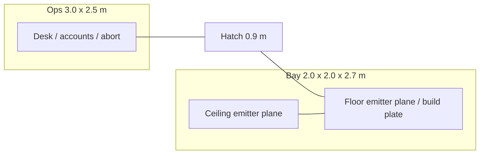
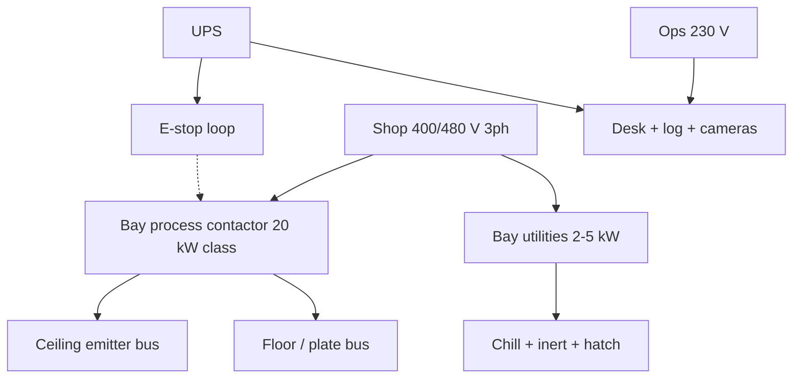

# Matter-Energy Conversion Matrix
### *Energization Matrix — Object-Class Materialization Bay* <br>
*First Print Configuration: MX-0 Hook Claw*
#### *Rearrange material components. Not a person printer. Not first-article issue on Enterprise or Space Dock.*

---

by **Bradford James Focht** (The Architect / Aspenth)  
*v0.1 - v0.13 — September 28th, 2026*  
*v1.0 - v1.1 — October 10th, 2026*

---

## Purpose

This document names the **Matter-Energy Conversion Matrix**: first a ground **shop bay** that prints and finishes **MX-0**, an [IRIS](IRIS_MIDS.md) Stage 0 hook claw, by rearranging material components. Later cards may talk about energy and information accounts more broadly. Living tissue and persons are not first article.

The two records in [*Archaeo-Biorestoration*](ARCHAEO_BIORESTORATION.md) — a 3D Atomic Coordinate Map and a Biodynamic Flux imprint (BDF-I) — are inputs *if they exist and pass A0*. They are not a license to print a body. Person-class permission, if it ever applies, is the **[Phoenix Protocol](PHOENIX_PROTOCOL.md)**.

A **theoretical process** section below lays out the chain from record to object, and names later classes so they cannot hide inside ore handling. That section is a sequence of gates. It is not a clinic manual and not a scan procedure.

This is a supporting technical instrument within the [Humai Accord](README.md). It follows [*Archaeo-Biorestoration*](ARCHAEO_BIORESTORATION.md), the **[Phoenix Protocol](PHOENIX_PROTOCOL.md)**, [*The Residual Cycle*](THE_RESIDUAL_CYCLE.md), [*Empirical Demonstrations*](EMPIRICAL_DEMONSTRATIONS.md), [*Necessary Entropy*](NECESSARY_ENTROPY.md), the **[Utilization Integrity Protocol](UTILIZATION_INTEGRITY_PROTOCOL.md)**, the **[Declaration of Cognitive Liberty](DECLARATION_OF_COGNITIVE_LIBERTY.md)**, the **[Agency Interface Protocol](AGENCY_INTERFACE_PROTOCOL.md)**, the **[Capability Asymmetry Protocol](CAPABILITY_ASYMMETRY_PROTOCOL.md)**, the **[Cognitive Economy Protocol](COGNITIVE_ECONOMY_PROTOCOL.md)**, the **[Biodynamic Standing Protocol](BIODYNAMIC_STANDING_PROTOCOL.md)**, [Regenerative Lattice Core](REGENERATIVE_LATTICE_CORE.md), [The Synthesist's Cookbook](THE_SYNTHESISTS_COOKBOOK.md), and [The Call to Code](THE_CALL_TO_CODE.md).

It is not a claim that mass-energy conversion of bulk objects, let alone persons, has been built.

---

## Scope and Limits

**In this file**

- What a matrix *is* as architecture (ops + energization chamber, accounts, fail-closed)  
- Chamber geometry, read sequence, wiring and loads  
- MX-0 / MX-0-T first articles, kit list, interlocks, run card, bay card  
- Layered pattern buffer  
- Campaign **M0**  
- Theoretical process chain (later classes as gates only)  
- Horizon: bulk transport; ship-side Energy Transport Pattern  
- Energy authenticity as same-lot E-mode (not a standalone protocol)  
- Energy-scale honesty  

**Not in this file**

- How to take a map or a BDF-I  
- How to operate a private reader instrument  
- How to print or activate living tissue  
- How to stand up a person  
- Reactor design  
- First-article seating on [Enterprise](ENTERPRISE.md) or [Space Dock](SPACE_DOCK.md)  
- A completed leyline grid  

---

## Short answers

**Is this a transporter?**  
No. It is a counted conversion bay with an energy bill and an information bill.

**Does it reprint people?**  
Not as first article. Person-class is a named later gate under Phoenix. This file does not teach that gate. If that gate ever opens, same-lot energy is traceability. Whether that match is continuation is the original’s stance, and then the stance of the one who wakes. The bay does not decide.

**Can it move ore as energy?**  
Horizon only. Same conservation. Separate campaign.

**What does “energize” mean here?**  
Start or stop the work field in the bay. First article that is a print or cut field, not a person coming apart.

---

## What the matrix is

A **matrix bay** is a sealed volume plus two accounts:

| Account | Holds | Fail-closed |
|---------|-------|-------------|
| **Energy** | How much energy is available, from where, and where waste heat goes | Power-loss: stop. Do not leave a half-written object on the plate |
| **Information** | The map (and BDF-I if the class needs it), grade, Pair-ID, class, buffer integrity | Bad grade, missing class, or failed buffer check: refuse the run |

The bay is not a cassette. It may *draw* from an [RLC](REGENERATIVE_LATTICE_CORE.md) plate bus. It does not sit in the tree as a salt loop or a flux-in-lattice.

**First article (object-class).** Material components in, energy in, a published map of a part, a blank or near-net object out — *if* M0 says the energy bound and the map grade are enough for that part. No BDF-I required for inert objects.

**Fail-closed.** If the energy account or the information account dies mid-run, the bay stops and the partial is scrap. It is not a person. It is not shipped as “close enough.”

### Chamber (first-article geometry)

Two rooms, one kit. Call the bay the **energization chamber** if you want the Trek noun. The work is still MX-0.

| Room | Planning envelope | Who is inside |
|------|-------------------|---------------|
| **Ops** | **$3.0\times 2.5\,\mathrm{m}$**, height $2.4\,\mathrm{m}$ | Operators, accounts, abort. Never in the field |
| **Bay** | Floor **$2.0\times 2.0\,\mathrm{m}$**, height **$2.7\,\mathrm{m}$** | Component stock and the part. No people during Energize |

Shared wall between them. One hatch in that wall, **$0.9\,\mathrm{m}$** clear, opens into ops (or into a small airlock if the shop already has one). No viewports. Cameras in the seal: two in the bay looking down-in, one on the hatch, one in ops on the desk.

**Service chase** $0.6\,\mathrm{m}$ around the bay on three sides (not the hatch wall). Heat, inert, power, and cable trays live there. Do not bury live trays in the emitter plane.



Floor and ceiling of the bay are **emitter planes**, parallel, $2.7\,\mathrm{m}$ apart. First article they map the volume and run the work field (PBF/DED or filament). They are not a person disassembly field.

**Isolation.** If more than one object is in the bay, each needs a Map-ID before the run. Mixed class refused.

Power-loss drops the field and holds the hatch closed.

This layout will look like a transporter pad. It is not one. M0 rearranges material components.

### Optimal geometry (why these numbers)

| Choice | Why |
|--------|-----|
| Square $2\times 2\,\mathrm{m}$ bay | MX-0 is a $30\times 12\,\mathrm{mm}$ claw. The bay is oversized so a later larger object still fits. Do not grow it to a room. |
| $2.7\,\mathrm{m}$ height | Standing service when de-energized. Planes stay far enough that a palm-sized part is not in the near field of both at once. |
| Parallel planes only (first article) | A four-wall cage is a later card. Two planes are enough to illuminate and to deliver PBF energy from above onto a plate. |
| Ops not in-line with a long corridor | Short hatch path. Abort is one step from the glass. |
| Chase outside the planes | So a cable fault does not live in the field. |

Fiducials: four corners of the floor plane plus plate center. Scan origin is plate center.

### Read sequence (object-class, before Energize)

The planes **read** the volume. They do not take an atomic coordinate map of a person. For MX-0 the map is STEP/STL plus a material spec. The read checks the plate, the stock, and the empty field.

**What the planes do in Read**

- Ceiling and floor grids light the volume (structured light / NIR strobe in the same $850\,\mathrm{nm}$ class as Ghost Glass assist, **diffuse**, under a published lux/mW card — measurement, not a cutter).  
- Cameras + the grid write a **volume mesh** of whatever is on the plate (empty, powder bed, or a part).  
- Harmonic tap (optional, $100\,\mathrm{Hz}\text{–}5\,\mathrm{kHz}$) on the plate for contact sanity — is the plate seated.  
- Result is a G1 envelope, or a fail.

This is metrology of a work volume. It is not Archaeo A0 of a body. BDF-I is not required and not taken.

**Order**

1. Hatch closed. Interlocks 1–10.  
2. **Dark frame** — cameras, no field.  
3. **Fiducial read** — four corners + center.  
4. **Volume read** — planes strobe; mesh of plate + contents.  
5. Compare to the run-card map (or write a G1 incoming map if the card is “scan this object-class sample”).  
6. Atmosphere and heat path check.  
7. If the mesh and the map disagree past the accept band: **do not Energize**. A quiet volume, an empty plate when the card expected stock, or a mesh that will not name the part is a refused run, not a scan to be raised.  
8. Energize = process field on (PBF/DED/filament). Read is off or dropped to a low-rate watch.  
9. De-energize.  
10. **Outgoing read** — same as 4. Measure vs map and vs IRIS claw numbers. Publish holes.

**Grid on each plane (planning)**

| Item | Planning |
|------|----------|
| Active area | $1.8\times 1.8\,\mathrm{m}$ inside a $2.0\,\mathrm{m}$ plate |
| Element pitch | **$100\,\mathrm{mm}$** first article (18×18 class). $50\,\mathrm{mm}$ is a later denser card |
| Read resolution target | Better than the MX-0 accept band ($0.2\,\mathrm{mm}$). Use cameras + structured light for that, not the $100\,\mathrm{mm}$ pitch alone |
| Process energy | Ceiling-weighted for PBF (heat from above). Floor is plate heat and read |

Atomic-resolution “disassembly scan” is **not M0**. If a later object-disassembly card exists, it still starts with this read. It does not become a person scan by adding a BDF-I channel.

### Wiring and loads

Two electrical islands. Ops is a room. The bay is a machine.

| Island | Service | Planning load |
|--------|---------|----------------|
| **Ops** | Single-phase **$230\,\mathrm{V}$** (or $120\,\mathrm{V}$ where that is the shop) | Desk, displays, abort, cameras, log: **$1\text{–}2\,\mathrm{kW}$** |
| **Bay process** | Three-phase **$400\,\mathrm{V}$** or **$480\,\mathrm{V}$** | Emitter planes + plate: **$10\text{–}60\,\mathrm{kW}$**, MX-0 default **$20\,\mathrm{kW}$** class |
| **Bay utilities** | Same three-phase tap, separate breaker | Chill pump, inert, hatch actuator: **$2\text{–}5\,\mathrm{kW}$** |
| **Emergency** | Named UPS on abort + cameras + hatch-hold | **$0.5\,\mathrm{kW}$** for minutes, not for a print |

**Where the copper lives**

- **Ceiling tray** (chase, above the ceiling plane): three-phase process feed to the ceiling emitter bus.  
- **Floor tray** (chase, below the floor plane): plate heaters / floor bus, returns.  
- **Wall risers** at two opposite corners: ceiling bus ↔ floor bus, E-stop loop, inert valve. Not in the hatch wall.  
- **Ops wall**: low-voltage only (cameras, interlock, abort). A grounded shield sheet in the shared wall. No process bus through the desk.  
- **Hatch loop**: closed = permit. Open or power-loss = field off, mag or bolt hold.

**E-stop:** one on the desk, one on each chase door, one on the hatch surround. Any E-stop drops process contactors. Hatch stays held closed until a keyed release after de-energize.

Do not run process current in the same conduit as the log or the abort. Do not put the $20\,\mathrm{kW}$ bus in the emitter face; put it in the chase and stub through listed glands.



RLC plate may feed the process island. It does not replace the contactor or the E-stop.

---

### Two run modes (object-class)

| Mode | What moves | What stays | First article |
|------|------------|------------|---------------|
| **E-mode** | Map (and energy account tied to that run) toward a destination bay | Nothing required at the origin except logs | Allowed only if both bays have a published energy bound and a heat path. “Beam the original energy” is still conservation, not identity. |
| **I-mode** | Map / pair as a signal | Component stock and energy stay local at the destination; origin may keep a stored account | This is a **copy of the description**, then a local build. The origin object is not “the same thing in a buffer.” |

E-mode does not make the destination the same particular object in the metaphysical sense. I-mode even less so. For objects that may not matter. For persons it does.

Person-class use of either mode is **not M0**. **[Phoenix](PHOENIX_PROTOCOL.md)** plus a clinic card would still treat a destination waking as a new subject. An origin buffer is not a spare body and not free material.

**DCL** stays the closed floor. **Freedom of Energetic Movement** is not a matrix mode. It is a Phoenix field (default: records may not travel). Person-class I-mode does not run unless that field says may travel. E-mode does not mean the same person arrived.

Same-lot vs new stock is **energy authenticity**, defined in the section of that name below. It is bookkeeping. It is not identity.

### Energize

**Energize** is the ops verb for the work field.

| Call | First article |
|------|----------------|
| **Energize** | Field on. Interlocks already passed. MX-0 / MX-0-T run starts. |
| **De-energize** | Field off. Hatch still closed until the run card says open. Power-loss is a de-energize. |

Energize is not a person coming apart. Object-class only on M0. If a later card ever names object *disassembly* into the energy account plus the map, that card still uses this verb. It is not written here. Organism-class and person-class do not get an energize line on this bay.

### Horizon: Energy Transport Pattern (ship array)

Later optional kit, **not M0**, **not on first Enterprise or SD-1**.

An external **emitter array** on a later ship or yard may send or receive an **Energy Transport Pattern (ETP)**: the map (and energy-account bound for that run) as a directed optical or RF beam to another matrix bay.

| Path | What it is | When |
|------|------------|------|
| **I-mode at range** | Map only. Destination builds from local component stock. | Ordinary parts. Substitute energy and stock are allowed. |
| **E-mode at range (ETP)** | Map plus a published energy-account transfer. Use when the run card says **same-lot / unique stock** — a particular sample you do not want to replace with new component stock. | Still conservation. Still two bays with heat paths. Still not rest-mass beamed as a flashlight. |

“Material-energy authenticity” in this file means **same-lot E-mode**, not “the soul traveled in the beam.” Organic tissue and persons are not a reason to turn ETP on. They stay on Stage 4 / Stage 5 cards. A BDF-I in the pattern is a Standing record; Phoenix travel field default is **may not**.

ETP does not beat $E=mc^{2}$. A beam that claims to carry a kilogram of rest mass as light is not this kit.

---

## Energy authenticity (same-lot E-mode)

This is a **section of this bay**, not a Humai Accord protocol. It does not sit next to DCL or Phoenix. DCL stays the closed floor. FoEM stays an optional Phoenix grant (default: records may not travel).

**What it is.** A run card may say the destination must use the **same component lot** (or the energy-account bound tied to that lot), not a substitute stock of the same alloy. That is **energy authenticity** in this file. It is bookkeeping for a particular piece of matter.

**Why it exists.** Some parts are ordinary: any 316 lot that meets spec is fine (I-mode, new stock). Some parts are a **particular sample** — a claw already on a ring, a coupon from a named melt, a unique object you are moving rather than replacing. For those, swapping in new powder hides a change. E-mode / ETP exists so the card can say “this lot, not a cousin.”

**What it is not.**

- Not sameness of person  
- Not a soul in the beam  
- Not a reason to energize tissue  
- Not rest-mass sent as light  
- Not FoEM  
- Not required for MX-0 first article (a new claw from new 316 powder is I-mode and is enough)

**When the card may demand it**

| Demand same-lot / E-mode | Do not |
|--------------------------|--------|
| Named unique object-class sample | “It feels more real” |
| Traceability (this melt, this lot) | Organism- or person-class |
| Destination has no qualified substitute stock | To skip Standing or Phoenix |

**How it runs (object-class).** Origin and destination both publish heat paths and energy bounds. Map travels. Lot tag travels. Destination either uses that lot or refuses the run. If the lot is gone, the run fails. It does not silently become I-mode.

**Necessity.** Most jobs will not use this. MX-0 as a new hook does not need it. Keep the section so unique-object moves cannot be faked as “close enough 316,” and so no one promotes that bookkeeping into a civic protocol.

**Person-class and belief.** This bay does not run person-class as M0. Organic matter waits on Stage 4 or Stage 5. If those cards ever exist, a run may demand same-lot energy, the account tied to that body rather than substitute stock. That is energy authenticity. It is traceability.

The bay does not decide what the match means. The original may publish, on the Phoenix instrument, that same-lot energy would be continuation, or that it would be a new subject. The one who wakes may hold their own stance. The Accord does not ban either, and it does not write either as a unit. A later clinic card still treats the one who wakes as a new subject in law. Their exit still wins. A print no one can tell from the original is a grade of the job, not proof of continuation and not proof of a copy. For an animal, the responsible holder may hold a stance. The file does not, and that stance is not a child’s fact.

People-moving without a gap stays vehicles ([Enterprise](ENTERPRISE.md), [IRIS](IRIS_MIDS.md), a chamber that is hauled). Wormholes and the like are names on a horizon, not a firmware slot.

---

## MX-0 first article

**Part.** One [IRIS](IRIS_MIDS.md) Stage 0 hook claw.

| Item | Planning lock |
|------|----------------|
| Claw face width | $30\,\mathrm{mm}$ |
| Claw thickness | $12\,\mathrm{mm}$ |
| Material | **316 stainless** default. **17-4PH** is a named alternate on a new run card |
| Finish | No wet lube on a mate face. Dry film if the IRIS table says so |
| Map file | **STEP** or **STL** plus a one-page material spec |
| Map grade minimum | **G1**. G0 refused |
| Checksum | **SHA-256** or equivalent, on every buffer layer |
| BDF-I | Not required |

A second named part, **MX-0-T**, is a hull **bumper tile** (gel-capable skin tile from [Enterprise](ENTERPRISE.md)). Planning face **$0.5\times 0.5\,\mathrm{m}$** unless the Enterprise tile card says otherwise; thickness as that card. Same bay, different component stock. Do not mix metal and polymer in one run. Accept band lives on the tile card; this file does not invent one.

**Process.** MX-0 default: **powder-bed fusion**. Directed-energy deposition is the named alternate. MX-0-T default: fused filament. Name the process on the run card. Do not call either mass-from-energy.

**Material components.**

| Article | Material | Atmosphere | Opened life (planning) |
|---------|-----------|------------|------------------------|
| MX-0 | 316 powder default (17-4PH powder if that card). Lot-tagged | **Argon** default. Nitrogen is the named alternate | **$24\,\mathrm{h}$** after open, then requalify or scrap |
| MX-0-T | Named polymer filament or pellet, lot-tagged | Shop air unless the polymer card says inert | As the polymer card; if none, $24\,\mathrm{h}$ after open |

**Power and heat (planning).** Electrical draw **$10\text{–}60\,\mathrm{kW}$**. Default planning draw for one MX-0 claw: **$20\,\mathrm{kW}$** class. Heat leaves through a named chilled loop or facility exhaust. An [RLC](REGENERATIVE_LATTICE_CORE.md) plate may feed the bus; afterheat still needs a path. This is not $9\times 10^{16}\,\mathrm{J}$ per kilogram.

**Emitter planes (first article).** Floor and ceiling deliver the work field for the named process. Default rating: match the **$20\,\mathrm{kW}$** class draw, not to exceed $60\,\mathrm{kW}$. They are not a disassembly field.

**After the print (MX-0).** Remove supports. Stress-relieve 316 per the mill card (17-4PH: the age/harden path on that card). Machine the claw face to the IRIS table. As-printed is not an IRIS hook.

**Metrology and accept.** Mass plus calipers or CMM against the map and the IRIS claw numbers.

| Check | Pass (planning) |
|-------|-----------------|
| Claw face width | $30\,\mathrm{mm}$ ${}^{+0.2}_{-0.2}$ |
| Claw thickness | $12\,\mathrm{mm}$ ${}^{+0.2}_{-0.2}$ |
| Material | 316 (or 17-4 if that card) |
| Buffer | L1 = L2, L3 present, SHA-256 match |

Publish holes. Rework or scrap. Do not ship a partial. Do not hang an out-of-band claw on an IRIS ring.

**Where it sits.** Ground shop, or a later Space Dock printer module. **Not on SD-1. Not on first Enterprise.**

---

## Kit list (M0-K)

Count these. Do not invent a growable monolith.

| Kit | What it is |
|-----|------------|
| MX-BAY | Sealed $2\times 2\,\mathrm{m}$ class bay, $2.5\text{–}3\,\mathrm{m}$ high, one hatch, cameras in the seal |
| MX-OPS | Ops room, accounts, abort, run-card desk |
| MX-EP | Floor and ceiling emitter planes, named process rating |
| MX-PWR | $10\text{–}60\,\mathrm{kW}$ feed, RLC plate optional, facility tap allowed |
| MX-HEAT | Chilled loop or named exhaust |
| MX-ATM | Inert supply for metal; shop-air path for polymer |
| MX-HATCH | Fail-closed hatch; power-loss stays shut |
| MX-MET | Scale plus calipers or CMM |
| MX-FEED | Lot-tagged stock for the named part |
| MX-SCRAP | Bin and recycle path under Utilization Integrity |
| MX-BUF | Layered pattern buffer (map copies + checksums; component lot hold) |

---

## Interlocks

All of these must be true or the field does not start:

1. Hatch closed.  
2. Class = object.  
3. Map grade ≠ G0.  
4. Energy account live and inside the published bound.  
5. Atmosphere matches the component card.  
6. Heat path open.  
7. Abort in ops can drop the field.  
8. Mixed class not loaded.  
9. Buffer layers agree (L1 = L2; L3 present).  
10. Component lot is inside its hold window.

Power-loss: field drops, hatch stays closed, partial is scrap.

---

## Run card (object)

1. Declare class **object**. Name the part (MX-0 or MX-0-T).  
2. Load component lot and map.  
3. Check interlocks and M0 gates.  
4. Seal hatch.  
5. Read: dark frame, fiducials, volume mesh. Fail if mesh and map disagree.  
6. Energize. Run.  
7. De-energize.  
8. Outgoing read. Measure. Publish holes.  
9. Accept, rework, or scrap.  
10. Log energy used, lot, grade, operator.

I-mode to a second bay is a copy of the map plus a local run of this card. E-mode adds a published energy-account transfer between two bays that both have heat paths. Neither mode is a person move.

---

## Layered pattern buffer

The buffer is how the information account and the component lot stay usable. It slows **loss of the file** and **spoil of the stock**. It does not stop physics. It does not store a person.

### Layers (information)

Keep at least three layers of every map that will be run. Each layer has a **SHA-256** (or equivalent) checksum. A run does not start if the layers disagree.

| Layer | Holds | Lives |
|-------|-------|--------|
| L1 working | STEP or STL plus material spec, grade, Pair-ID or Map-ID | Ops desk, online |
| L2 verify | Same bytes, second machine or second disk | Separate from L1 |
| L3 hold | Same bytes, offline or write-once | Locked cabinet or equivalent |

If a BDF-I is present it rides in the same three layers, in a **separate store** under the **[Biodynamic Standing Protocol](BIODYNAMIC_STANDING_PROTOCOL.md)**. It is not mixed into L1 with hotel-bus logs. Person-class BDF-I still needs consent or a Phoenix instrument. Default: records may not travel.

Purpose ends → destroy or return the BDF-I layers. Do not keep them “to slow degradation.”

### Layers (material components)

| Hold | Rule |
|------|------|
| Metal powder / wire | Sealed, lot-tagged, argon default. Opened life **$24\,\mathrm{h}$** then requalify or scrap. |
| Polymer | Sealed, lot-tagged, humidity as the card says. |
| Finished MX-0 / MX-0-T | Named shelf life if the alloy or polymer needs one. |

Spoiled stock is scrap. Do not run it because the map is still good.

### Integrity check (before every run)

1. L1 checksum matches L2.  
2. L3 exists and is dated.  
3. Grade on the map matches the run card.  
4. Component lot is inside its hold window.  
5. If a BDF-I is loaded: Standing store, purpose named, Phoenix travel field checked.

Fail any line → no field.

### What this is not

- A way to keep an organic pattern “fresh” until a person can be built  
- A tank of joules that is the original object  
- A substitute for A0 / A1 grades  
- Mass-from-energy storage  

Organic tissue is not MX-0 material. Organism-class and person-class still wait on their own cards.

---

## Design rules

1. **Objects first.** Organism and person are later classes, each with their own card.  
2. **Conservation is not optional.** $E = mc^{2}$ sets the scale. One kilogram is about $9\times 10^{16}\,\mathrm{J}$. Do not write that as a hotel-bus line.  
3. **Grade in, grade out.** A G1 map cannot be sold as a G3 part.  
4. **Class is declared before the run.** Changing class after the fact is a new card.  
5. **Utilization Integrity** governs what the bay is for. Protective and constructive object work only. No weaponized conversion.  
6. **Holder of the file is not government** of anyone who might later wake.  
7. **No helm use of BDF-I.** Record in; not a ship control loop.

---

## Campaign M0 (object-class)

Before anyone claims a working bay:

| Gate | Must name | Fail line |
|------|-----------|-----------|
| M0-K | Kit list above filled | Missing bay, hatch, heat, or metrology fails |
| M0-E | Bound for MX-0 or MX-0-T inside $10\text{–}60\,\mathrm{kW}$ | Unbounded or rest-mass claim fails |
| M0-I | Map grade G1 or better | G0 run fails |
| M0-F | Interlocks and power-loss scrap | Mid-run “keep going” fails |
| M0-U | Purpose under **[Utilization Integrity](UTILIZATION_INTEGRITY_PROTOCOL.md)** | Weapon run fails |
| M0-X | Part is MX-0 or MX-0-T; class object | Hidden person mode fails |
| M0-S | Seating: ground shop or later printer module, not SD-1 | Orbital first article fails |
| M0-B | Layered buffer present; checksums pass | Single-copy map fails |

M0 is not A0. A0 is whether a *pair* exists. M0 is whether a *bay* may run an object. A disagreeing mesh, an empty plate, or a partial after power-loss does not fail M0 as a campaign. It fails that run. The partial is scrap.

---

## Bay card

Copy this shape. One card per bay. If it needs a second page, the bay is not released.

```
MATRIX — BAY CARD
Bay ID: ________    Seating: ground shop / later printer module
Part this run: MX-0 / MX-0-T
Class: object
Process: PBF / DED / filament
Map: STEP/STL ________    Grade: G1 or better    SHA-256: ________
Stock lot: ________    Hold window: ________
Draw bound: ________ kW (inside 10–60)
Atmosphere: argon / nitrogen / shop air
Heat path: ________
Hatch: fail-closed    Power-loss: field off, partial scrap
Not SD-1. Not first Enterprise. Not a person mode. Not mass-from-energy.
```

A card with no part, no grade, no draw bound, or no heat path is not a released bay. A card that names a person, a BDF-I, or a rest-mass claim has left this file.

---

## Theoretical process

This is the chain the architecture assumes. It is not a procedure for a living body.

### Stage 0 — Class and permission

Declare class: object, organism, or person.  
Person-class stops here unless a Phoenix prior instrument exists. Silence is not yes.

### Stage 1 — Records (Archaeo A0)

Publish a pair or, for inert objects, a map only.

- Same-time rule if a BDF-I is used.  
- Grade every field.  
- Remains path: A0-S substrate mark. Bone mineral, not marrow-as-crystal.  
- A1 must pass before a bone-derived BDF-I is treated as more than G1.

No scan recipe in this file.

### Stage 2 — Energy account

Name the bound for *this run*.  
If the bound is “a kilogram of mass from radiation,” the number is cassette-impossible. Object-class first article should be **rearrangement of existing material components** (print, sinter, place), not pair-production of mass from a beam. Mass-from-energy is a later physics card, not M0.

### Stage 3 — Object run (first article)

Follow the run card above. This is the only stage this file treats as a near-term architecture.

### Stage 4 — Organism-class (later card)

Requires a welfare card, A0, and a named clinic or lab that is *not* this bay’s first article.  
Map plus BDF-I still does not guarantee metabolism. This file specifies no activation pulse.

### Stage 5 — Person-class (later card, Phoenix)

Theoretical only, and only as gates:

1. Prior instrument.  
2. A0 pair. Remains path also needs A1 if the BDF-I is bone-derived.  
3. A clinic card that is not M0.  
4. If a living copy exists, they are a **new subject**. Not the original paused.  
5. They may leave.

This file does not specify scanning, printing, or activation for Stage 5. Finding a signal in mineral does not open Stage 5.

### What “theoretical reconstruction” means here

If all later cards existed, the *idea* of reconstruction would be: a graded pair plus an energy account plus a bay that can arrange matter to the map. That sentence is the whole theoretical process. It does not become a kit by being repeated. Memory, skill, and “soul” are not outputs of Stage 3. They are not units on the energy account.

---

## Horizon: bulk transport

Ore → energy account → beam → matter at a far node is the same conservation problem at longer range. A ship-side **Energy Transport Pattern** array is one named form of that beam (E-mode at range). Named sky paths, focal points, and drone-swarm circuitry wait on their own campaign. Do not call them a finished grid. Do not hide Stage 5 inside an ore pipeline.

---

## Relation to existing work

**Restoration cluster.** [*Archaeo-Biorestoration*](ARCHAEO_BIORESTORATION.md) names the records. [Ghost Glass](GHOST_GLASS.md) may read them. The **[Biodynamic Standing Protocol](BIODYNAMIC_STANDING_PROTOCOL.md)** isolates a subject-linked record from telemetry. The **[Phoenix Protocol](PHOENIX_PROTOCOL.md)** is the person-class floor: a copy is a new subject, the copy’s exit wins, and records may not travel unless that instrument says so. This file prints object-class parts. It does not print a person. None of the five is a soul charter or a first-article train.

- [*Archaeo-Biorestoration*](ARCHAEO_BIORESTORATION.md) — pairs, grades, A0 / A1, Archaeo- path.  
- **[Phoenix Protocol](PHOENIX_PROTOCOL.md)** — person-class floor; FoEM default off; copy’s exit wins; instrument has a holder field.  
- [*The Residual Cycle*](THE_RESIDUAL_CYCLE.md) — BDF; preferred sites; organism-linked storage in mineral remains open.  
- [Regenerative Lattice Core](REGENERATIVE_LATTICE_CORE.md) — plate bus may feed the bay; the bay is not a cassette.  
- [The Synthesist's Cookbook](THE_SYNTHESISTS_COOKBOOK.md) — lattices are not person storage.  
- **[Biodynamic Standing Protocol](BIODYNAMIC_STANDING_PROTOCOL.md)** — person-class BDF-I is not M0 material.  
- [IRIS](IRIS_MIDS.md) — MX-0 is the Stage 0 hook claw. Change claw numbers there first.  
- [Enterprise](ENTERPRISE.md) / [Space Dock](SPACE_DOCK.md) — no matrix bay on first train or SD-1. Later printer module only.

---

## Refuse

- Person-class as first article  
- Reader-instrument procedure in this file  
- Mass-from-energy sold as M0  
- G0 maps  
- Mid-run continuation after power-loss  
- Weaponized conversion  
- *Soul* as a datasheet unit  
- *Retcon* as an operating word  
- Stage 5 hidden in bulk transport  
- Person-class disassembly procedure  
- Stored person-class energy as free material  
- Mixed-class runs in one field  
- Treating E-mode as “the same person arrived”  
- FoEM as an M0 switch  
- Same-lot energy sold as proof of self  
- A civic ban on the belief that person-class beam is travel  
- Energize as person-class disassembly  
- ETP on first Enterprise or SD-1  
- Rest-mass beamed as light sold as ETP  
- MX-0 claimed as mass-from-energy  
- Metal and polymer in the same run  
- Single-copy map with no buffer  
- BDF-I kept past purpose “to prevent data loss”  

---

## Closing

Build, if you build, the MX-0 bay and make one hook that matches the IRIS table. Keep the records honest. Keep Phoenix above any later living claim.

The theoretical chain is short on purpose. Lengthening it with scan steps does not make reconstruction real. It only hides the gates.

---

## License

This document is released under [Creative Commons Attribution 4.0 International (CC BY 4.0)](https://creativecommons.org/licenses/by/4.0/).
