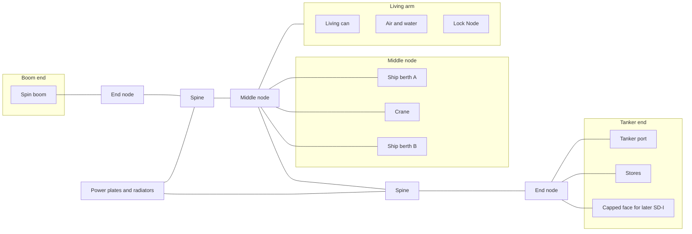
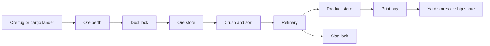

# Space Dock
### Modular Orbital Yard for Enterprise-Class Trains
#### *The same parts around Earth, the Moon, or Mars — not a city in orbit*

---

by **Bradford James Focht (The Architect / Aspenth)**  
*v1.0 - v1.1 — September 24th, 2026*    
*v1.2 - v1.4 — September 25th, 2026*    
*v1.5 - v1.13 — September 26th, 2026*  
*v1.14 - v1.18 — September 27th, 2026*    

---

## Purpose

This document describes **Space Dock**: a modular yard built in orbit. It docks, joins, spin-tests, fuels, and services [Enterprise](ENTERPRISE.md)-class ships.

The same parts can be used around Earth, the Moon, or Mars. You build a separate yard at each place. You do not fly one yard from planet to planet.

A dock is a truss with a counted number of berths. It is not a city. Licensed source articles (KP-10-S or FSP-40-S class) seat on [Regenerative Lattice Core](REGENERATIVE_LATTICE_CORE.md) plates. RLC cassettes convert heat and buffer power. Solar cells sit in the truss skin. Cranes and tugs move modules. A spin boom tests a disc before that disc is joined to a ship. Tankers connect at a published port. This file does not explain how to build a reactor or a weapon.

This is **second-generation** orbital architecture. It assumes a first generation of chemical interplanetary ships (Starship-class and similar) has already made mass-to-orbit cheap enough to assemble yards and trains. Space Dock is the reusable yard for the infrastructure and colony work that follows those first ships. It does not replace them and it does not fly from planet to planet.

This is the dock named in Enterprise gate E0-D. It uses the same RLC power plates and the same docking hardware as Enterprise: the **IRIS ring** ([IRIS / MIDS](IRIS_MIDS.md)). It follows the [Humai Accord](README.md), including [*Necessary Entropy*](NECESSARY_ENTROPY.md), [*Why Walk When You Can Ride?*](WHY_WALK_WHEN_YOU_CAN_RIDE.md), the **[Utilization Integrity Protocol](UTILIZATION_INTEGRITY_PROTOCOL.md)**, the **[Exterior Viability Protocol](EXTERIOR_VIABILITY_PROTOCOL.md)**, the **[Architectural Elasticity Protocol](ARCHITECTURAL_ELASTICITY_PROTOCOL.md)**, the **[Capability Asymmetry Protocol](CAPABILITY_ASYMMETRY_PROTOCOL.md)**, the **[Agency Interface Protocol](AGENCY_INTERFACE_PROTOCOL.md)**, the **[Structured Transition Protocol](STRUCTURED_TRANSITION_PROTOCOL.md)**, the **[Cognitive Economy Protocol](COGNITIVE_ECONOMY_PROTOCOL.md)**, and [The Call to Code](THE_CALL_TO_CODE.md).

This is not a launch license. It is not a claim that a yard already exists. Masses below are planning estimates. Campaign D0 replaces them with measured values.

---

## Scope and Limits

**In this file**

- Parts list and how those parts bolt together  
- Separate orbit plans for Earth, the Moon, and Mars  
- Berths, crane, tugs, spin boom, tanker port, and dock power  
- Steps from the first truss piece to the first Enterprise hookup  
- How to grow the yard by adding more truss spines  
- Shutdown checklists, keep-out distances, and launch-fairing limits  
- Campaign D0, which must be finished before the first truss is opened in orbit  
- A written list of connections that Enterprise gate E0-D needs  
- Later add-on shops: large printers, ore handling, and refining (not on the first launch)  

**Not in this file**

- Ground spaceports, rockets, or surface fuel plants  
- Warp drive, weapons, or folding solar wings  
- How to make or handle reactor fuel  
- Quake Columns, Gulpgates, or Stormcrashers hardware on the truss  
- Ghost Glass, *The Residual Cycle*, or **Predictive Harmony Metrics** as dock controls  
- Treating whoever holds a power cassette as the person in charge of the yard or a docked ship  
- A promise that the orbit is free of debris  
- Firing Enterprise main engines while the ship is on the berth  
- One dock that moves itself from Earth to the Moon to Mars  

---

## Short answers

**Is the dock a city?**  
No. It is a work yard. Sleeping space is for an eight-person crew. The ship’s twelve people do not live here unless a written plan says so.

**Can one dock serve Earth, the Moon, and Mars by flying there?**  
No. Build a copy at each place. Use the same part numbers. Each place has its own orbit plan. An Earth control room cannot be the only way to shut a berth down.

**Can the dock take the ship’s engine thrust?**  
No. The ship leaves the dock, then burns. Thrust goes through the ship’s own lock bars, not through the dock truss.

**Where is a disc spun for the first time?**  
On the spin boom. First with no disc, then with the disc, then stop the spin, then attach the disc to the ship. Do not spin a disc while it is already part of a moving train.

**What docking hardware does the yard use?**  
[IRIS](IRIS_MIDS.md) **Stage 0**: locked **$1.00\,\mathrm{m}$** opening, **$1.60\,\mathrm{m}$** ring, 12 hooks in two sets of 6. Ship berths use the full stack ($0.40\,\mathrm{m}$ tunnel). Yard living cans use the short stack ($0.20\,\mathrm{m}$ tunnel). Live blade motion waits on IRIS I1–I4. Do not add a third type.

**What is the first complete yard?**  
**SD-1**: one truss spine, two ship berths, one tanker port, one spin boom, two tugs, counted power cassettes, eight people on watch.

---

## Locked defaults

| Item | Default | Change only if |
|------|---------|----------------|
| Docking hardware | IRIS Stage 0: **$1.00\,\mathrm{m}$** opening, **$1.60\,\mathrm{m}$** ring, 12 hooks | A written test and an IRIS table revision. Do not add a third type. Live iris waits on I1–I4. |
| Power | KP-10-S or FSP-40-S source on RLC plates, plus skin solar | No folding wings. RLC converts; it is not the source. Ship may feed the yard only on a written card. |
| First yard | **SD-1** | An uncrewed SD-0 rack may fly first |
| How to grow | Add more spines | Do not grow one berth into a huge single dock |
| Crew on the dock | **8** for SD-1 | More people only with extra living cans |
| Pointing | Reaction wheels, plus magnetorquers if the planet’s magnetic field is useful | Small thrusters only for emergencies |
| Spin tests | Boom only | Spinning a disc on a live train is not allowed |
| Reconnecting modules | Modules must be stopped (not spinning) | Same steps as Enterprise |
| Largest disc on the first boom | $25\,\mathrm{m}$ if gate D0-S passes | If not, limit the first boom to $15\text{–}20\,\mathrm{m}$ |

---

## Why a yard instead of one big can

Enterprise is a string of modules. The yard has to hold the front power section, park discs, and join them. The ship should not have to be its own factory.

A modular dock means you can launch parts on ordinary heavy-lift rockets, build a small SD-1 at one planet, build the same parts at another planet, add spines when a second ship arrives, and shut one berth without shutting the whole yard.

If two designs both work, pick the part you can launch twice.

---

## Design rules

1. **Count parts.** More work means more spines and more berths.  
2. **One kind of docking hardware.** Ship berths and yard cans differ in length, not in type.  
3. **Safe default when power dies.** Berths stay latched. The boom brake comes on. Flexible joints freeze at a set angle.  
4. **Cutting electric power is not the same as dumping heat.** A seated cassette still needs a radiator path.  
5. **A problem on a ship must not kill dock power.**  
6. **Holding a cassette is not command.** Seating a cassette follows the RLC three-party check. Holding the yard plate does not put you in charge of a docked ship.  
7. **Solar cells stay in the skin.** Impact gel sits in bumper tiles, not under live cells.  
8. **Test the disc on the boom before you join it to the ship.**  
9. **Local shutdown does not wait for a vote from Earth.**  
10. **Planning masses stay estimates** until gate D0-K replaces them with measured numbers.  
11. **No Jeffries-tube city.** Panels you can open standing, or pull the whole kit. Same rule as Enterprise.

---

## Parts list

Each part flies as a sealed kit with a checklist. Masses are planning tonnes. Replace them in D0-K.

| Kit ID | Part | Job | Est. t | Notes |
|--------|------|-----|--------|-------|
| SD-S01 | Spine bay | Truss section, skin solar, bumper tiles | 12 | Repeatable $8\text{–}12\,\mathrm{m}$ section |
| SD-S02 | Node | Three-way joint, utilities, wheels | 8 | Ends and middle of the yard |
| SD-B01 | Ship berth ring | IRIS Stage 0 full stack | 6 | Two per SD-1; IRIS face ~$0.15\,\mathrm{t}$ of this kit |
| SD-B02 | Tanker / cargo port | Same IRIS type; fluids, not a crew disc | 5 | $1.00\,\mathrm{m}$ opening until IRIS-C |
| SD-B03 | Cassette plate adapter | RLC power plate | 2 | Same plate as the ship |
| SD-B04 | Alignment rails | Line up tethers and discs | 1.2 | Mounts on B01 |
| SD-C01 | Crane | Move a disc, connector, or cassette | 4 | Planning reach **$40\,\mathrm{m}$** from the middle node; D0-C confirms |
| SD-C02 | Yard tug | Small craft that moves a stopped module | 3 | **Two** on SD-1 |
| SD-C03 | Spin boom | Holds a disc and spins it to about $0.3\,g$ | 7 | Hardest part. See Boom. |
| SD-C04 | Lock-bar service stand | Fit and inspect ship thrust bars | 2 | Does not fire engines |
| SD-C05 | Dust cover / purge kit | Covers berths at the Moon and Mars | 0.6 | Not needed at Earth by default |
| SD-P01 | RLC-10-class cassette | Dock power | 4.5 | Count how many, same rule as the ship |
| SD-H01 | Living / commons can | Housing for eight | 15 | Not a $25\,\mathrm{m}$ disc on day one |
| SD-H02 | Dock air and water | Life support for the watch | 6 | Separate from ship air and water |
| SD-H03 | Stores / shop can | Spares, gel, connectors | 10 | |
| SD-H04 | Lock Node | Yard egress hub; six IRIS Stage 0 faces | 16 | Same article as the ship. Unused faces capped. No suitports. |
| SD-K01 | Traffic beacon | Lights, ranging, radio | 0.4 | Not a weapon |
| SD-K02 | Traffic desk | Computers and radio watch | 0.3 | Required at Earth; useful everywhere |

**Docking rule.** Every pressurized mate on this yard is an [IRIS](IRIS_MIDS.md) Stage 0 ring. Full stack on SD-B01. Short stack on living cans. Same type on SD-B02 and later SD-I02. If power dies, hooks stay closed and power stays open. Local undock does not wait on Earth. Live blades and ferrofluid are not SD-1 hardware.

**Solar rule.** Cells are in the skin only. Gel is in bumper tiles, not under live cells.

---

## SD-1 parts count (first outfitting)

Planning only. Do not treat the total as the real launch mass.

| Kit | Qty | Role on SD-1 |
|-----|-----|----------------|
| SD-S01 spine bay | 6 | Straight truss |
| SD-S02 node | 3 | Two ends and the middle |
| SD-B01 ship berth | 2 | Opposite each other at the middle node |
| SD-B02 tanker port | 1 | Tanker end |
| SD-B03 plate adapter | 2 | One in use, one spare seat |
| SD-B04 alignment rails | 2 | One per ship berth |
| SD-C01 crane | 1 | Middle node |
| SD-C02 tug | 2 | Two ways to move a module |
| SD-C03 spin boom | 1 | Boom end |
| SD-C04 lock-bar stand | 1 | Inspection only; no engine firing |
| SD-C05 dust cover | 0 at Earth / 2 Moon / 2 Mars | Per orbit plan |
| SD-P01 cassette | 4–6 | See Power |
| SD-H01 living can | 1 | Short arm off the truss |
| SD-H02 air and water | 1 | Same arm |
| SD-H03 stores | 1 | Tanker end |
| SD-H04 Lock Node | 1 | Living arm; waist faces are lander or space door; unused capped |
| SD-K01 beacon | 2 | Keep-out zone |
| SD-K02 traffic desk | 1 | Watch |

At catalog masses this is about **$200\text{–}250\,\mathrm{t}$** before cassettes and before any Enterprise module. That number will change. D0-K replaces it.

---

## Yard sizes

| Class | Spines | Ship berths | Tanker ports | Spin booms | Crew | What it can do |
|-------|--------|-------------|--------------|------------|------|----------------|
| **SD-0** | 1 short | 0 | 1 | 0 | 0–2 | Uncrewed storage / tanker rack |
| **SD-1** | 1 | 2 | 1 | 1 | 8 | Build one ship; park one spare module |
| **SD-2** | 2 | 4 | 2 | 2 | 12–16 | Two ships, or one ship plus heavy repair |
| **SD-n** | $n$ | $2n$ | $n$ | $n$ | +8 per extra spine after 2 | Add spines |
| **SD-I** | +1 industrial spine | same ship berths | + ore / print ports | 0 extra boom required | +4 to +8 process crew | Printers, ore, and refining after SD-1 works |

SD-1 is the first crewed yard. SD-0 may fly first with no crew. Do not enlarge a single berth until it is a whole station. Printers and refineries are an **SD-I spine** bolted on later. They are not part of the first launch.

---

## Layout (SD-1)

A straight truss. A node at each end. A node in the middle.

- **Middle node.** Two ship berths facing opposite ways so the front of a ship and a lander (or two discs) can sit without blocking the crane.  
- **Boom end.** Spin boom sticks out clear of the berths.  
- **Tanker end.** Tanker port and stores can.  
- **Living arm.** Sleeping space and air/water on a short arm, away from hoses and tools.  
- **Power bay.** Cassette plates and radiators on the back of the truss.  
- **Later stub (capped).** The tanker-end node keeps one unused face so an industrial spine (SD-I) can bolt on without moving the ship berths.

GitHub can draw the block diagram below (Mermaid). If a viewer does not render it, the bullet list above is the same layout.

How to read it: boom on the left, ship work in the middle, fuel and stores on the right. The unused face on the right is where printers and ore modules attach later.  

**Keep-out zone (planning).** A clear sphere from the middle node that covers crane reach, a spinning $25\,\mathrm{m}$ disc, tug approach, and tanker hoses. Planning lock: **$80\,\mathrm{m}$** radius until D0-B measures. Only the module being moved sits in that sphere. Separately: IRIS magnets stay **$1.0\,\mathrm{m}$** from an RLC plate face.

**Launch size.** Spine bays, nodes, berth rings, and living cans must fit a published rocket fairing. This file assumes a Starship-class fairing, about $8\,\mathrm{m}$ wide and $\sim 17\text{–}18\,\mathrm{m}$ high cargo. A $25\,\mathrm{m}$ Enterprise disc does **not** launch in one piece. It flies as pie-slice sections, is joined at the yard, then tested on the boom. If a part cannot fit the fairing even in sections, it is not an SD-1 part.

**Fairing stack (planning, D0-L).** Each line is one heavy-lift flight or a shared flight if mass allows. Order is yard first, then ship pieces.

| Flight | Load | Notes |
|--------|------|-------|
| Y1 | SD-0 rack + tanker port | Uncrewed |
| Y2 | Two nodes + first spine bays | |
| Y3 | Power plates + first KP-10-S or FSP-40-S seats | No fuel fabrication |
| Y4 | Living arm + air/water | |
| Y5 | Crane, two tugs, rails | |
| Y6 | Two SD-B01 berths + tanker fittings | IRIS Stage 0 faces |
| Y7 | Spin boom (empty) | D2 after install |
| S1–S*n* | Disc slices (8–12 slices per $25\,\mathrm{m}$ disc) | Joined at yard, then D3 |
| S-fore | Fore stack sections | Hall empty of source cores if the license requires a separate nuclear flight |
| S-tether | Tethers, IRIS faces, longerons | |

Slice count: a $25\,\mathrm{m}$ disc into pieces that fit an $8\,\mathrm{m}$ fairing is **8–12 slices**, not one can. Exact count waits on the disc drawing. Nuclear source articles fly under that license, not as ordinary cargo on Y3 if the license forbids it.

---

The living-arm **Lock Node (SD-H04)** is the same six-face article as the ship: fore to the living can, four waist rings that can be a lander or a space door, aft capped unless a later module sits there. Unused faces stay capped. A lander parks on a waist face. Reverse-prop (RP-1) may sit on a berth or a stub. It does not fire at the yard.

---

## Berth and reconnecting

Ship berth SD-B01 uses [IRIS](IRIS_MIDS.md) **Stage 0**. Numbers below are copied from IRIS I0. Change them there first, then here.

| Item | Yard lock |
|------|-----------|
| Opening | **$1.00\,\mathrm{m}$** |
| Ring outside | **$1.60\,\mathrm{m}$** |
| Hooks | **12** in two sets of 6 |
| Full-stack tunnel (SD-B01) | **$0.40\,\mathrm{m}$** |
| Short-stack tunnel (living cans) | **$0.20\,\mathrm{m}$** |
| Ports | Data and power: MIL-DTL-38999 III. Air: 25 mm aerospace QD. Water: 12 mm aerospace QD. |
| Stuck-mate | Dual mechanical release + hand crank. No pyro on first article. |
| Seal | Metal face plus inboard elastomer; hatch inboard |
| Power-loss | Hooks closed; power open |
| Approach box | Closing $\leq 0.05\,\mathrm{m/s}$; offset $\leq 0.10\,\mathrm{m}$; angle and clock $\leq 5^\circ$ |
| Keep-out from an RLC plate face | **$1.0\,\mathrm{m}$** or a measured map |
| IRIS-C ($2.00\,\mathrm{m}$) | Later. Not on first SD-1 crew berths. |

Blade motion and ferrofluid wait on IRIS I1–I4. The berth must still latch if power dies. Either side of a mate can be the active hook side.

**Reconnect steps** (same order as the ship):

1. Stop the module’s spin if it spins.  
2. Run that module on its own battery or tug power.  
3. Line it up on the SD-B04 rails.  
4. Make the mechanical connection.  
5. Open air only if the checklist says so.  
6. Connect data and shutdown sensing.  
7. Close the power connection.  
8. Write down the new ship layout if the module is joining a train.

If power dies: the berth stays latched and the power connection stays open. A hook that goes slack is a failed hook.

A docked ship may take power from the yard only with written permission. The default is: the ship uses its own plant; the yard uses its own cassettes.

---

## Boom

The spin boom is the hardest part of the yard.

It must hold a disc at the published radius, spin it to about $0.3\,g$ (about $3.3\,\mathrm{rpm}$ at $25\,\mathrm{m}$), measure bearing heat and balance, then **stop the spin** before anyone attaches that disc to a ship.

How the disc itself spins (still hub core, turning rim, motors and brakes) lives in [Enterprise](ENTERPRISE.md). The boom is the first place that motion is proven. Do not invent a second spin story here.

**Boom bearing.** First article is mechanical, same as ship C04. A magnetic bearing on the boom (the old sleep-pod levitation, scaled) is a later D-gate after D0-S measures heat and whirl on the mechanical set. Power-loss still slams the brake. Maglev does not hold a spinning disc if the brake is the safety.

**No booth hotel.** The living can does not spin. Do not fill it with phone-booth centrifuges for sleep or showers. Watch wash is air-and-liner wet cells in $0\,g$, or a docked disc that is **stopped**. A single short-radius chair in storage is optional, not eight sleepers.

A $25\,\mathrm{m}$ disc at that speed has a lot of stored spin. Gate D0-S must state:

- Largest radius this boom may hold  
- Brake time and stop time  
- How much the middle berths shake (those berths **lock** during a spin)  
- What happens if power dies (the brake comes on)  

If D0-S cannot pass at $25\,\mathrm{m}$, the first boom is limited to $15\text{–}20\,\mathrm{m}$, and the first Enterprise discs follow that limit. Do not spin a disc on a live train because the boom is busy.

**D0-S planning numbers** (replace with a spin test):

| Item | Planning lock |
|------|----------------|
| Max disc | $25\,\mathrm{m}$, $0.3\,g$ $\approx 3.3\,\mathrm{rpm}$ |
| Held mass class | **$25\,\mathrm{t}$** outfitted disc |
| Stop time | **$90\text{–}180\,\mathrm{s}$** commanded brake |
| Power-loss brake | On within **$10\,\mathrm{s}$** |
| Middle-node shake while locked | $\leq 5\,\mathrm{mm}$ planning |
| Stored spin (order) | $\sim 1\,\mathrm{MJ}$ for a 25 t rim-heavy disc at that rate |

---

## Power (yard)

Same idea as the ship, smaller crew.

| Load | SD-1 planning band | How it is met |
|------|--------------------|---------------|
| Dock lights, pumps, crane, boom | $20\text{–}40\,\mathrm{kWe}$ | 3–4 **KP-10-S** in use plus 1 spare (or one FSP-40-S plus a spare seat). RLC-10 converts; it is not the source. |
| Skin solar | Extra house power in sunlight | Not the crane’s only source |
| Thermoelectric leftover heat | Logged house power | Not counted as main plant output |
| Docked ship | Ship’s own plant, or yard power if a card allows it | Breakers on the tie; ship shutdown stays independent |

Number of cassettes: in-use units = round up (needed kWe ÷ kWe per unit). Keep at least one spare.

**Yard plant (planning).** Same hall rule as the ship: chamber stays, source article upgrades. Meet $20\text{–}40\,\mathrm{kWe}$ with **three to five 10 kWe-class licensed units plus one spare**, or **one 40 kWe-class unit plus one spare seat**. Conversion is RLC (Stirling first, TE on reject). Primary reject panels are required ($\sim 2\,\mathrm{m^2}$ per kWe class). Emergency panels are a second isolated set, not the only reject path. No geothermal coupler on the truss.

After you cut electric power to a cassette, heat still has to go somewhere. Radiators sit on the back of the truss. Do not put a geothermal coupler on an orbital yard. That option stays in the RLC file for surface stations.

---

## What the yard must provide for Enterprise

Enterprise gate E0-D can be marked “interfaces written” when **D0-E** lists all of these. That is not the same as a working berth in orbit.

| What Enterprise needs | What the dock provides |
|-----------------------|------------------------|
| Dock the front section | Two SD-B01 berths, IRIS Stage 0 ($1.00\,\mathrm{m}$ / $1.60\,\mathrm{m}$ / 12 hooks) |
| Fit a tether | Crane plus alignment rails |
| Spin-test a disc | Boom SD-C03; stop spin before joining the ship |
| Reconnect modules | Steps above |
| Fit thrust lock bars | Stand SD-C04; no engine firing unless a later plan names a clear blast zone (default: no firing) |
| Load engine fuel | Tanker port SD-B02 |
| Swap an RLC cassette | Plate SD-B03; follow RLC rules |
| Park a spare disc | Second berth or an extra truss stub |
| Backup if one mover fails | Two tugs, plus a second berth or an SD-0 rack |
| Join a $25\,\mathrm{m}$ disc from sections | Crane, rails, then boom test |
| EVA and unsuited walk-out | Yard **Lock Node** (SD-H04), six Stage 0 faces, unused capped. No suitports. |
| Park a lander | A waist face on the ship or yard Lock Node. Not a new connector. |
| Optional reverse-prop (RP-1) | Hold on a berth or stub. **Do not fire** at the yard. |

If a need is not in this table, the first yard does not promise it.

---

## Orbit plans — same parts, three places

The parts stay the same. The orbit plan changes.

### Earth (SD-1E)

**Job.** Build the first ships. Fuel them for a high-orbit departure.

**Orbit (planning lock).** Circular **$900\,\mathrm{km}$**, inclination **$28.5^\circ$** (or the published heavy-lift inclination if that pad cannot do 28.5). Not $400\,\mathrm{km}$ ISS. Drag is lower; debris still needs a D0-A budget; this stays under the worst of the inner belt for a crewed yard.

**Departure.** After tankers, the *ship* raises to a **$20{,}000\text{–}36{,}000\,\mathrm{km}$** parking / departure stack and burns from there. That raise does **not** push on the dock. D0-O may tighten these two altitudes; it may not silently drop back to $400\,\mathrm{km}$.

**Magnetic field.** Magnetorquers help. Wheels are still required.

**Extra.** Traffic and debris tracking (D0-A). No folding solar wings to “dodge” debris.

### Moon (SD-1L)

**Job.** Service Enterprise-L. Restock suits and drill tools. Catch a lander that missed a landing window.

**Orbit (planning lock).** Southern L2 **near-rectilinear halo orbit (NRHO)**, 9:2 lunar-synodic family: period **$\approx 6.5\,\mathrm{d}$**, perilune radius **$\sim 3{,}200\,\mathrm{km}$** ($\sim 1{,}500\,\mathrm{km}$ altitude), apolune radius **$\sim 70{,}000\,\mathrm{km}$**. Same class as Gateway. Low lunar orbit is refused as the default.

**Magnetic field.** Magnetorquers are weak. Keep extra wheels.

**Extra.** Dust from landers. Fit dust covers (SD-C05) on berths. If the watch services suits, do that on the living arm. Do not dump drill cuttings into the truss.

### Mars (SD-1M)

**Job.** Receive Enterprise-M. House the six people who stay on the ship. Restock long-duration food and parts. Catch Lander-M.

**Orbit (planning lock).** Circular **$8{,}000\,\mathrm{km}$**, inclination **$0\text{–}30^\circ$**. Below areostationary ($\sim 17{,}000\,\mathrm{km}$ altitude) so first insertion is cheaper; high enough for lander staging. Dust storms stay a ground problem. The yard still needs a dust and blackout plan for lander approach. Areostationary is a later comms-relay card, not SD-1M.

**Magnetic field.** Not useful like Earth’s. Use wheels, and small electric tugs if D0 allows.

**Extra.** Time. Spare parts and gel assume months, not a two-week Earth stay. To repair one ship while another is arriving, add a second spine (SD-2M). Do not turn SD-1M into a tangle of extra rooms.

You may run Earth, Moon, and Mars yards at the same time. They use the same part numbers. They do not share one Earth control room as the only shutdown path.

---

## Build order (SD-1)

Rockets and ground work are not specified here. In orbit:

1. **SD-0 rack** (optional): tanker port and a short truss, no crew.  
2. First **spine bay and two nodes**. Pointing on wheels. Skin solar on.  
3. Seat the **first RLC cassette**. Follow RLC seating rules. Dock power comes on.  
4. Fit the **living arm** and air/water. Crew of 4, then 8.  
5. Fit the **crane** and **two tugs**.  
6. Fit **two ship berths**, alignment rails, and the **tanker port**.  
7. Fit the **spin boom**. Spin it empty. That is campaign **D2**.  
8. Receive the first **Enterprise disc** in sections if needed; join them; approach with spin stopped. Spin on the boom. That is **D3**. Stop the spin. Dock it.  
9. Receive the **front section**. Do not fire ship engines. Inspect lock bars on SD-C04.  
10. Join the first tether on the rails. Follow the reconnect steps.  
11. Call the yard “SD-1 open” only after the berth, boom, plate, and tug shutdown checklists all work.

If you skip a step, you have a storage rack, not a dock. **D1** is the uncrewed spine plus power plate (steps 2–3), not the empty boom spin.

Do not attach printer, ore, or refinery modules before step 11. Those wait for an SD-I spine and campaign D0-I.

---

## Later add-ons: print shops, ore, and refining

These modules are **not** on the first launch. They become useful once landers and tugs start bringing rock and metal from the Moon, Mars, or nearby small bodies. Bolt them onto the capped face at the tanker end as a separate spine (**SD-I**). Keep dust, heat, and process chemicals off the living arm and off the ship berths.

**Rule.** Ore and print shops share the same docking hardware type as the rest of the yard. They get their own power breakers and their own air. If a refinery vents or a printer jams, you shut that spine. You do not shut the ship yard.

### Parts (later — not SD-1)

| Kit ID | Part | Job | Notes |
|--------|------|-----|-------|
| SD-I01 | Industrial spine bay | Extra truss for shops | Same as SD-S01, marked for dust and heat |
| SD-I02 | Hauler / ore berth | Dock a cargo lander or ore tug | Not a crew berth |
| SD-I03 | Ore lock and bag dump | Move rock inside without dumping dust on the yard | First dust barrier |
| SD-I04 | Ore store | Bins or bags for raw rock | Count bins; do not use ship stores |
| SD-I05 | Crush / sort can | Break and sort rock | Vibration isolated from ship berths |
| SD-I06 | Refinery can | Heat or chemical step to metal, oxygen, or slag | Heat dump on this spine only |
| SD-I07 | Product store | Bar, powder, or tank output | Feedstock for printers |
| SD-I08 | Large print bay | Make large spare parts and later disc sectors | Power-hungry; own breakers |
| SD-I09 | Slag / waste lock | Bag slag and send it away or park it | Do not vent into the truss |
| SD-I10 | Sample / assay bench | Check what the rock actually is | Small; sits with I05 |

Masses wait for D0-I. Do not put them in the SD-1 launch total.

### Material path

Rock arrives at the ore berth, not at a ship berth. It goes lock → store → crush/sort → refinery → product store → print bay or ship stores. Waste leaves through the slag lock.

### Limits

- No mining plant on the dock. Mining stays on the ground or on a small-body site. The dock only receives what is hauled up.  
- No reactor-fuel work in the refinery. That stays out of this file.  
- First print jobs are spare brackets, rails, and boom parts. Printing a whole $25\,\mathrm{m}$ disc is a later campaign, not a first-shop claim.  
- Refinery heat does not share the ship-yard radiators.  
- Moon and Mars shops need dust covers (SD-C05) on the ore berth.  
- Earth SD-I may start with scrap and landed tanks instead of mined ore. Same spine, different incoming list.

### When to add SD-I

Add it after SD-1 is open and at least one Enterprise module has been joined on the boom. Gate **D0-I** must name: incoming rock or scrap type, dust path, heat dump, print power, waste path, and extra crew. If D0-I is not written, leave the tanker-end face capped.

---

## Pointing, debris, and traffic

The yard is stiffer than an Enterprise train. It still flexes when a disc spins on the boom.

- Wheels at the nodes. Magnetorquers at Earth.  
- During a boom spin, berths lock.  
- The yard holds its pointing. The ship bends at its own joints after it leaves. Do not try to steer the whole yard by bending dock joints.  
- Small gas thrusters are for emergencies only.  
- Bumper tiles and gel, same idea as Enterprise. Traffic desk (SD-K02) is required at Earth and useful at the Moon and Mars for lander approach.  
- Beacons (SD-K01) are lights and radio, not weapons.

### Traffic card (D0-A planning)

Earth SD-1E at $900\,\mathrm{km}$, $28.5^\circ$:

- Keep-out sphere **$80\,\mathrm{m}$** from the middle node while a disc is on the boom or a module is on a tug.  
- Closing on a berth follows the IRIS approach box ($0.05\,\mathrm{m/s}$, $0.10\,\mathrm{m}$, $5^\circ$).  
- Two tugs on watch when a module is free.  
- No ship assist burn inside $1\,\mathrm{km}$ of the truss.  
- Debris: treat $900\,\mathrm{km}$ as a tracked belt. Bumper tiles on. Traffic desk required. Conjunction screening before a boom spin. This card does not invent a debris-free orbit.  
- Radio: yard beacon + ship aft/fore comms. Earth is informed; Earth is not the only undock path.

Moon and Mars use the same keep-out and approach box. Moon adds dust covers on berths. Mars adds a lander blackout window on the desk.

---

## People

SD-1 watch is **8** people: two on power plates, two on crane and boom, two on berths and tugs, one with medical training, one relief.

They are not the Enterprise crew of 12. Those twelve do not live on the yard by default. If they must stay, use a docked living disc with its spin **stopped**, on a written card, with air and power that can be cut off from the truss.

Yard EVA and any unsuited walk to a free module go through the living-arm **Lock Node**, not through a berth hatch used as a door and not through a suitport.

Records, power, and water for the watch must still work if one can and one cassette fail.

**Yard ECLSS.** Same chemistry as [Enterprise](ENTERPRISE.md) E0-E, sized for **8** on watch, not 12. Electrolysis, regenerative CO₂, 90% water recycle, bottles and canisters as the isolate backup. Do not copy the ship’s Mars food or 12-crew tankage onto the living can.

---

## Access and service

Same rule as the ship. Living volume is for the watch. What must be reached is in the open, behind a panel, or a whole replaceable kit.

| Where | How you work on it |
|-------|-------------------|
| **Living can / air-water** | Floor, kick, and ceiling panels. Wet stubs and cable. One person with a driver. |
| **Truss spine** | Utility trays along the bay with hinged covers. Not a second tunnel inside the truss. |
| **Berth ring** | Service from the Lock Node or the berth vestibule. Hook blocks and ports face the mate plane. |
| **Lock Node** | Suit racks and lock hardware in that can. Dirty side stays there. |
| **Power plates** | Cassette pulls out on the plate rails. Afterheat path stays named. |
| **Boom / crane** | Bearings and motors are line-replaceable from the boom root. Not a crawl to the tip for a weekly check. |
| **Skin** | Solar tiles and gel bumpers from EVA or the crane. Not from inside the living can. |

**Rules.** If a weekly check needs a crawl, the layout is wrong. If a failed cassette, tug pack, or IRIS face cannot come off on the crane or through an IRIS hatch, it is not an SD-1 part.

---

## Stores (planning)

| Item | Earth SD-1E | Moon SD-1L | Mars SD-1M |
|------|-------------|------------|------------|
| Food for the watch | 90 days | 120 days | 180 days |
| Gel / bumpers | Resupply from Earth | Same, plus dust covers | Same, longer wait for resupply |
| Spare connectors / tethers | 2 | 2 | 3 |
| Spare IRIS Stage 0 face | 1 | 1 | 2 |
| Spare wheels / bearings | 2 sets | 3 | 4 |
| Spare cassette | 1 | 1 | 2 |
| Tanker buffer | Engine fuel + water | Water + suit gas | Engine fuel + water + extra food |

Exact masses wait for a D0 spreadsheet. Do not copy the ship’s long-trip food numbers onto the dock.

Solids and trash for the watch: dry or bag, store in SD-H03. Same chemistry idea as the ship, sized for 8. Do not dump overboard as the daily plan. Do not store trash next to O₂ bottles.

---

## Fire, shelter, view, and shake

**Fire.** Detect in the living can, Lock Node, berths, and plate bay. Isolate that volume. Two ways out of the living can (Lock Node and the truss hatch). Portable extinguishers plus mist or a named clean agent at the plates. Last resort: vent **that can or that berth only**. Do not vent a docked ship to save the yard, or the yard to save a ship. Plant afterheat still needs a radiator path.

**Storm shelter.** The yard has a named hole for a solar-particle storm. It is not a tenth spine and not “hide in the truss.”

**Primary volume:** the core of the living can (SD-H01), sized for the watch of **8**. Wrap it with water tanks and waste cans you already fly (SD-H02 / H03). That wrap is the shield.

**Backup volume:** the stores-can core (SD-H03) if the living can is the fire disc or is open to space. The Lock Node dirty vestibule is not a shelter.

**Same kit at all three yards.** Earth still builds the core so the part number does not change. Moon and Mars fill the wrap first; they have no magnetosphere to lean on. Earth may run a thinner wrap if D0 names belt vs storm, but the hole stays.

**Path.** From plates, crane, and berths: truss trays to the living arm, then into the core. From a boom EVA: Lock Node, then the core — not a two-hour suit wait. Warning-to-inside planning: **minutes**, not a shift change.

Dose (g/cm² of water-equivalent) waits on D0. The rule does not: eight people have a named volume, a backup volume, and a path that does not go through a spinning disc.

**View.** No picture windows in the living can. Cameras and skin sensors, screens inside. Lock Node may take one small E0 window. Berth rings are not windows.

**Shake.** Cassettes and boom motors sit on isolators. Truss bays are not one note: neighboring skins differ in stiffness or damping so the spine does not ring as one fork. The boom brake-on path is a structure path, not an air path. Active “play the truss” actuators are not SD-1.

---

## Shutdown checklists (minimum)

| Part | Must be on the card |
|------|---------------------|
| Berth SD-B01 | IRIS hooks closed, power off, air closed, local undock available without Earth |
| Boom SD-C03 | Brake on, spin stopped, berths locked |
| Plate SD-B03 | Electric power open; heat dump path still named |
| Tug SD-C02 | Held safe; second tug called |
| Living can SD-H01 | Air and water cut off from any docked ship |
| Lock Node SD-H04 | Hatches closed; dirty vestibule isolated from living can |
| Truss power | One dead berth does not black out the watch |

If the checklist needs a long explanation, the part is not ready.

---

## Command and shutdown

- Shutting a berth does not need permission from the docked ship.  
- Seating a cassette follows the RLC three-party check.  
- Holding the yard power plate does not make you captain of a docked ship.  
- Local shutdown does not wait for a vote from Earth.  
- Crew can interrupt dock controls under the Agency Interface Protocol.  
- Keep the paperwork short: shutdown cards, ship-layout list, traffic list. Do not run the yard from a “harmony” dashboard.

---

## Campaign D0

Finish this before the first truss section is opened in orbit:

| Gate | What must be named | Fail if |
|------|--------------------|---------|
| D0-K Parts | Part IDs; masses marked as **estimates** until weigh-in | Estimates treated as real launch mass |
| D0-O Orbit | Planet, period, debris or dust, time in shadow | “Some orbit” with no numbers |
| D0-P Power | How many cassettes, plate seats, heat dump path | No cassette manual |
| D0-B Berth | IRIS I0 match: $1.00\,\mathrm{m}$ opening, 12 hooks, approach box, $80\,\mathrm{m}$ keep-out planning, $1.0\,\mathrm{m}$ plate keep-out | A third connector type; a different locked opening than Enterprise |
| D0-C Crane/tug | Reach **$40\,\mathrm{m}$** planning from the middle node; **two** tugs | Only one tug; unnamed reach |
| D0-S Boom | Max disc radius, spin rate, stop time, shake at berths. Numbers named above. **Pass requires D2 empty spin + D3 loaded spin.** | Spin test on a live train; numbers with no test |
| D0-T Tanker | Port, fluids, **no engine firing** zone | Engine burn at the berth |
| D0-H Living | Eight-person watch; air/water separate from ships | Ship used as the silent dock generator |
| D0-A Pointing | Wheels, magnetorquers if any, traffic rules | Only gas thrusters to hold pointing |
| D0-L Launch | Fairing size; how a $25\,\mathrm{m}$ disc flies in sections | A part that cannot fit |
| D0-E Enterprise interface | Written close-out of Enterprise E0-D (IRIS I0, berths, plate, crane/tug, boom, tanker) | “We’ll make it fit later” |
| D0-I Industry | Rock or scrap type, dust path, heat dump, print power, waste path, extra crew | Printers or refineries on the first launch |

**D1.** Uncrewed spine plus power plate.  
**D2.** Empty boom spin.  
**D3.** First disc on the boom, then stop the spin.  
Then an Enterprise reconnect test.

---

## Feasibility

**Can this be built from kits?** Yes, if heavy-lift exists. Docking geometry lives in [IRIS](IRIS_MIDS.md) I0. Truss bays and berth rings are normal orbital construction. The spin boom is the hard part (bearings and the disc’s stored spin). Joining a $25\,\mathrm{m}$ disc from sections is the second hard part.

**Same design everywhere?** Same parts, yes. Same orbit, no. Each planet needs its own D0-O plan.

**Can it grow?** Yes. Add spines. That is counting, not a new invention.

**Will fail if you ignore these**

- Using the dock to take ship engine thrust  
- Spinning a disc on a live train because the boom is busy  
- Folding solar wings  
- Only one tug  
- Treating planning masses as the real launch mass  
- Launching a $25\,\mathrm{m}$ disc in one piece  

**Still missing (not docking).** A named orbit (D0-O). A cassette manual that sets how many units you need (D0-P). A boom spin test (D0-S). IRIS I0 is the shared docking lock with Enterprise. This file can finish Enterprise E0-D as a written list of connections plus those IRIS numbers. It cannot finish E0-D as a berth that already works in orbit.

---

## Relation to other Humai files

- [Enterprise](ENTERPRISE.md) — this is the dock that file assumed. Keep them as two files.  
- [IRIS](IRIS_MIDS.md) — Stage 0 ring on every pressurized mate. I0 numbers are copied above. Change them in IRIS first.  
- [Regenerative Lattice Core](REGENERATIVE_LATTICE_CORE.md) — power plates and counting cassettes. No surface geothermal coupler on this truss. $1.0\,\mathrm{m}$ keep-out from plate to IRIS magnets.  
- [*The Synthesist's Cookbook*](SYNTHESISTS_COOKBOOK.md) — crystal work stays in the cassette workshop, not on a berth.  
- Transit Hotel Bus (section inside Enterprise) — reconnect order and how to count power units versus spare cells.  
- [Stormcrashers](STORMCRASHERS.md), [Gulpgates](GULPGATES.md), [Quake Columns](QUAKE_COLUMNS.md) — not used as hardware here. Same working rule: name leftover load, shut down to a safe state, finish the campaign before you build.

---

## What this file does not allow

- A city in orbit that also happens to hold a ship  
- Folding solar wings  
- Firing Enterprise engines as a dock service  
- A third kind of docking hardware “just for the dock”  
- Geothermal or earthquake hardware on the truss  
- Earth remote control as the only shutdown path  
- One SD-1 that serves three planets by flying there  
- A warp drydock  
- Harmony or residual tools as dock controls  
- Using the dock as the ship’s thrust structure  
- Putting a refinery or print shop on the first SD-1 launch  
- Suitports as the yard door  
- A crawl-tube network as the way to reach weekly items  
- Dumping ore dust into the living arm or a ship berth  

---

## Names

**Space Dock** — the design family.  
**SD-0 / SD-1 / SD-n** — size.  
**SD-1E / SD-1L / SD-1M** — Earth, Moon, or Mars plan.  
**SD-I** — later industrial spine (printers, ore, refining).  
**Spine, berth, boom, tanker port** — main parts.  
**IRIS Stage 0** — the ring on those berths.  
**Lock Node (SD-H04)** — six Stage 0 faces. Same article as the ship. Waist = lander or space door. Unused faces capped. Not a suitport.

This sits with Enterprise and RLC as a build file. It is not a foundation protocol.

---

## Closing

Space Dock is a truss you can count: sections, berths, one boom, a power plate, two tugs. It uses the same docking hardware as the ship. It can be built around whichever planet the orbit plan names. It does not fly the ship and it does not replace the ship’s power plant.

It is the second-generation yard behind first-generation Starship-class flights: the place you assemble the trains that service a colony boom. If something fails, you should be left with a berth that is still just a berth — not a yard that tried to be a city.

---

## License

This work is licensed under the [Creative Commons Attribution 4.0 International License](https://creativecommons.org/licenses/by/4.0/).  
You are free to share and adapt this material for any purpose, even commercially, provided appropriate attribution is given, a link to the license is provided, and any changes are indicated.

This license covers the description. It does not give rights in other people’s standards, reactor kits, or patents. It does not give rights in Star Trek or any other fiction. Builders are responsible for launch, nuclear, and traffic licenses where they work.

No warranty of fitness, debris safety, or open berths is offered. The first honest result of a Space Dock is a measured truss with a measured power plate, not a picture around a planet.
