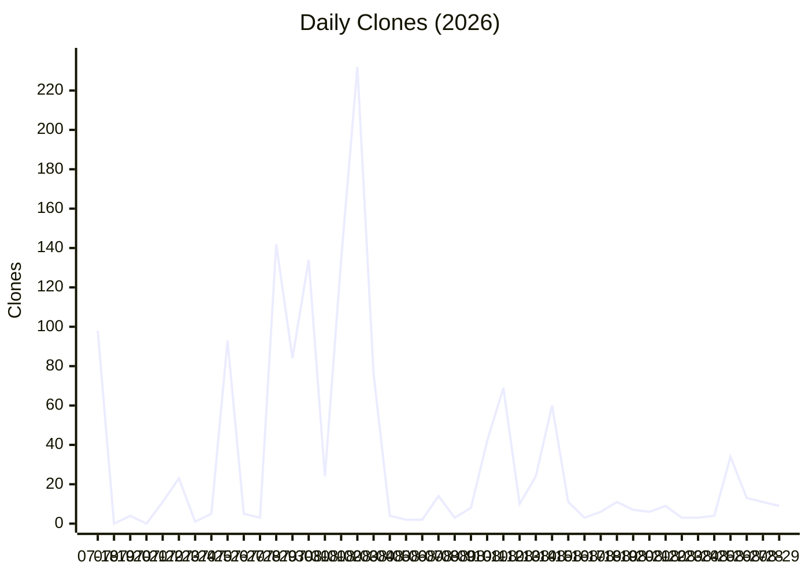
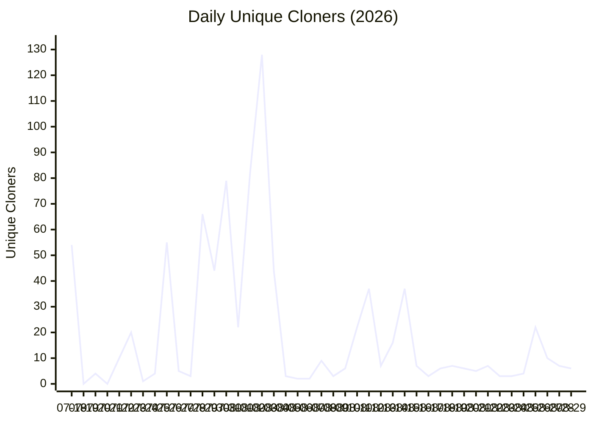
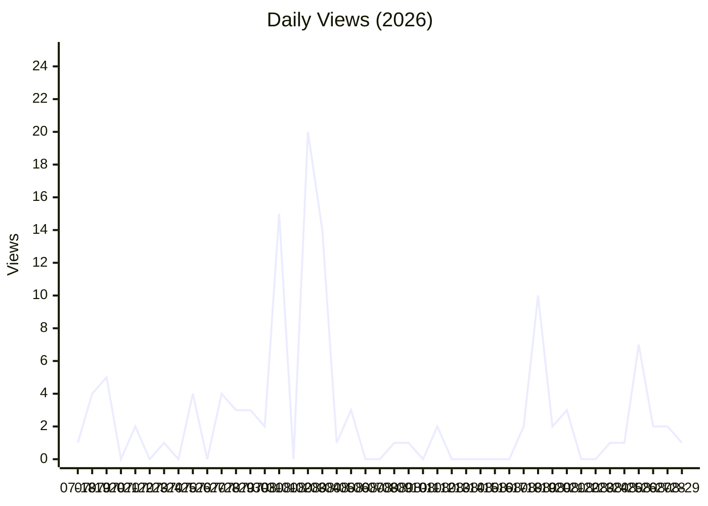
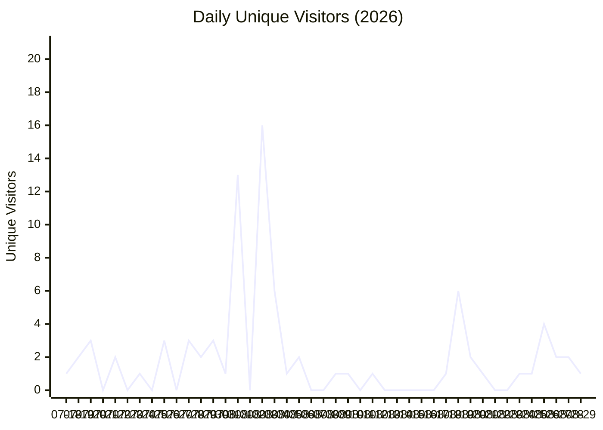

# Repository Traffic Report

**Last updated:** 2026-08-30T08:39:31 UTC

## Latest 14-day totals

- **Clones:** 130 total · 68 unique
- **Views:** 31 total · 18 unique

## Clones over time

## Unique Cloners over time

## Views over time

## Unique Visitors over time

## Recent daily numbers

| Date | Clones | Unique Cloners | Views | Unique Visitors |
|------|--------|----------------|-------|-----------------|
| 08-29 | 9 | 6 | 1 | 1 |
| 08-28 | 11 | 7 | 2 | 2 |
| 08-27 | 13 | 10 | 2 | 2 |
| 08-26 | 34 | 22 | 7 | 4 |
| 08-25 | 4 | 4 | 1 | 1 |
| 08-24 | 3 | 3 | 1 | 1 |
| 08-23 | 3 | 3 | 0 | 0 |
| 08-22 | 9 | 7 | 0 | 0 |
| 08-21 | 6 | 5 | 3 | 1 |
| 08-20 | 7 | 6 | 2 | 2 |
| 08-19 | 11 | 7 | 10 | 6 |
| 08-18 | 6 | 6 | 2 | 1 |
| 08-17 | 3 | 3 | 0 | 0 |
| 08-16 | 11 | 7 | 0 | 0 |
| 08-15 | 60 | 37 | 0 | 0 |
| 08-14 | 24 | 16 | 0 | 0 |
| 08-13 | 10 | 7 | 0 | 0 |
| 08-12 | 69 | 37 | 2 | 1 |
| 08-11 | 42 | 22 | 0 | 0 |
| 08-10 | 8 | 6 | 1 | 1 |
| 08-09 | 3 | 3 | 1 | 1 |
| 08-08 | 14 | 9 | 0 | 0 |
| 08-07 | 2 | 2 | 0 | 0 |
| 08-06 | 2 | 2 | 3 | 2 |
| 08-05 | 4 | 3 | 1 | 1 |
| 08-04 | 76 | 44 | 14 | 6 |
| 08-03 | 232 | 128 | 20 | 16 |
| 08-02 | 134 | 82 | 0 | 0 |
| 08-01 | 24 | 22 | 15 | 13 |
| 07-31 | 134 | 79 | 2 | 1 |

---
*Generated automatically by the traffic logging workflow.*