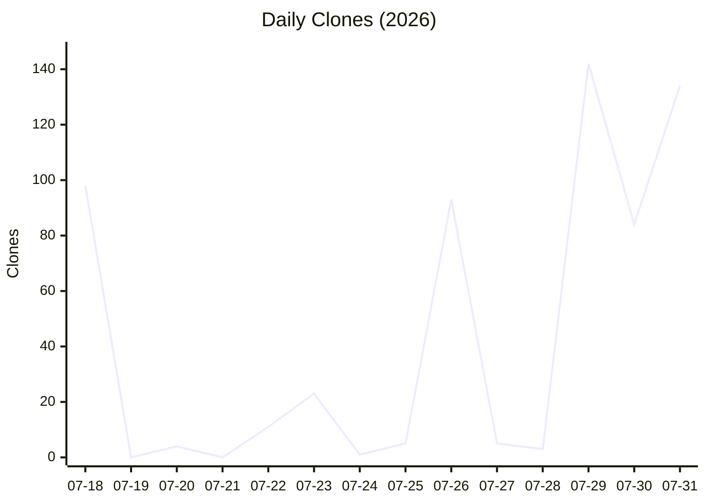
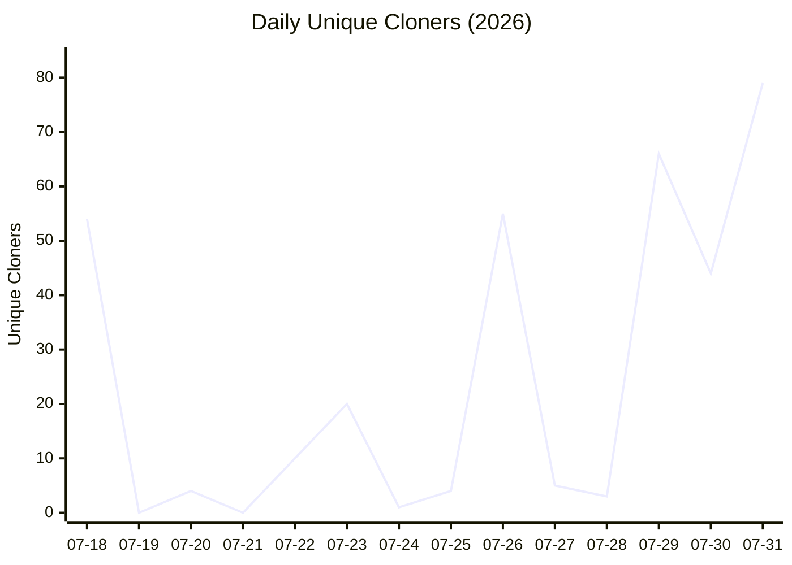
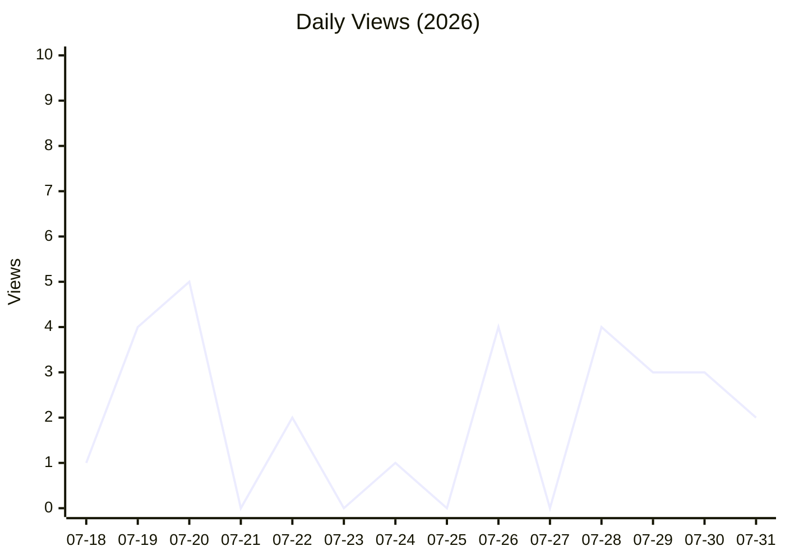
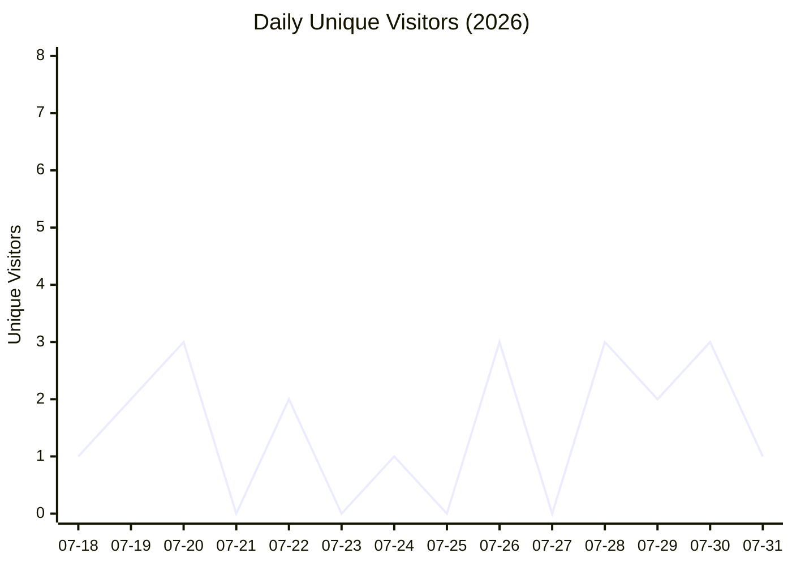

# Repository Traffic Report

**Last updated:** 2026-08-03T10:33:51 UTC

## Latest 14-day totals

- **Clones:** 603 total · 253 unique
- **Views:** 29 total · 18 unique

## Clones over time

## Unique Cloners over time

## Views over time

## Unique Visitors over time

## Recent daily numbers

| Date | Clones | Unique Cloners | Views | Unique Visitors |
|------|--------|----------------|-------|-----------------|
| 07-31 | 134 | 79 | 2 | 1 |
| 07-30 | 84 | 44 | 3 | 3 |
| 07-29 | 142 | 66 | 3 | 2 |
| 07-28 | 3 | 3 | 4 | 3 |
| 07-27 | 5 | 5 | 0 | 0 |
| 07-26 | 93 | 55 | 4 | 3 |
| 07-25 | 5 | 4 | 0 | 0 |
| 07-24 | 1 | 1 | 1 | 1 |
| 07-23 | 23 | 20 | 0 | 0 |
| 07-22 | 11 | 10 | 2 | 2 |
| 07-21 | 0 | 0 | 0 | 0 |
| 07-20 | 4 | 4 | 5 | 3 |
| 07-19 | 0 | 0 | 4 | 2 |
| 07-18 | 98 | 54 | 1 | 1 |

---
*Generated automatically by the traffic logging workflow.*