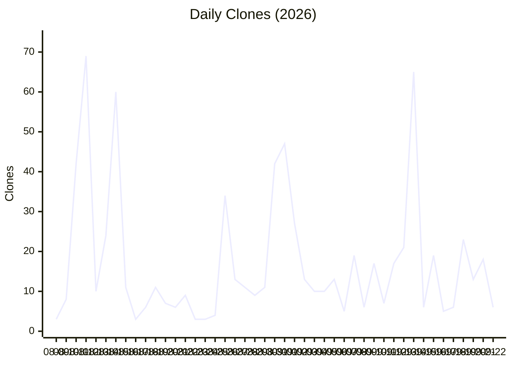
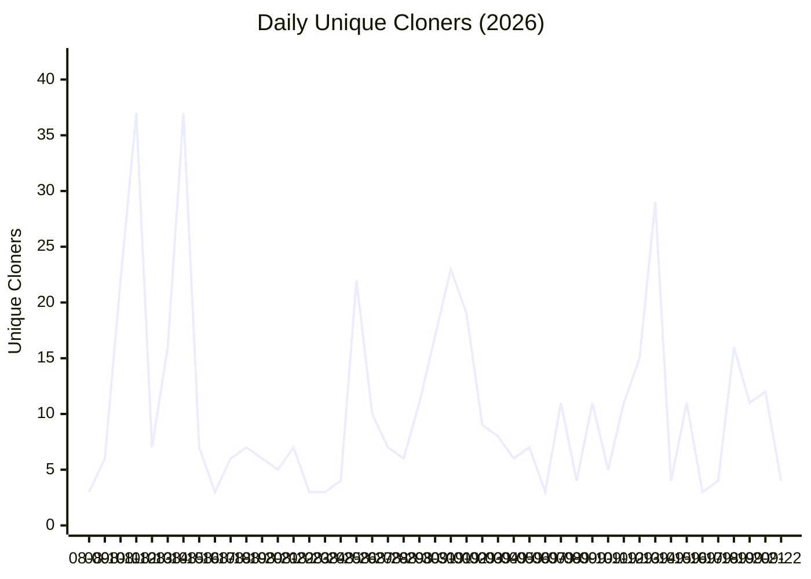
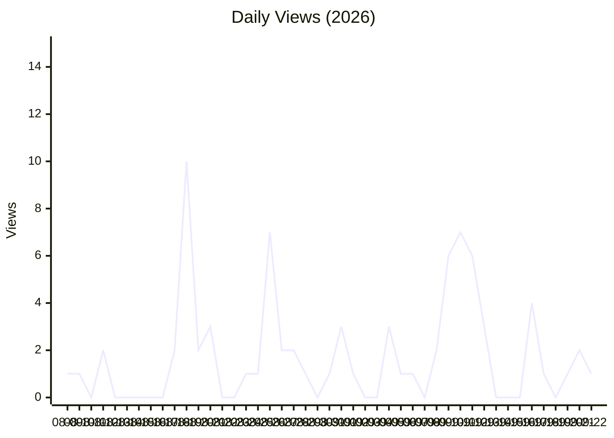
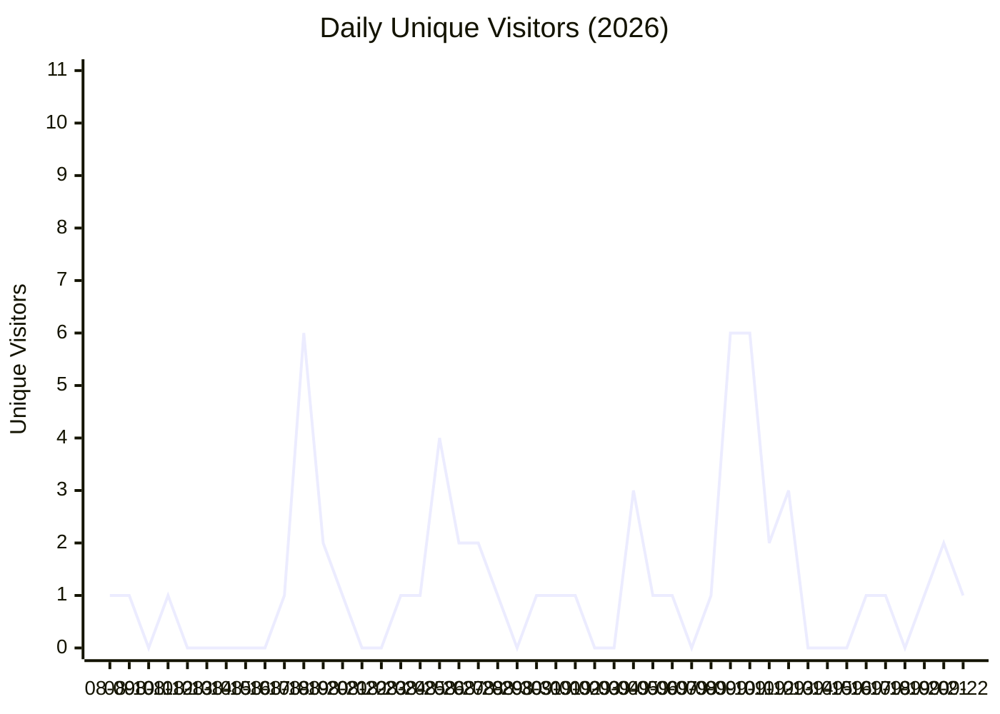

# Repository Traffic Report

**Last updated:** 2026-09-23T08:05:28 UTC

## Latest 14-day totals

- **Clones:** 229 total · 110 unique
- **Views:** 33 total · 20 unique

## Clones over time

## Unique Cloners over time

## Views over time

## Unique Visitors over time

## Recent daily numbers

| Date | Clones | Unique Cloners | Views | Unique Visitors |
|------|--------|----------------|-------|-----------------|
| 09-22 | 6 | 4 | 1 | 1 |
| 09-21 | 18 | 12 | 2 | 2 |
| 09-20 | 13 | 11 | 1 | 1 |
| 09-19 | 23 | 16 | 0 | 0 |
| 09-18 | 6 | 4 | 1 | 1 |
| 09-17 | 5 | 3 | 4 | 1 |
| 09-16 | 19 | 11 | 0 | 0 |
| 09-15 | 6 | 4 | 0 | 0 |
| 09-14 | 65 | 29 | 0 | 0 |
| 09-13 | 21 | 15 | 3 | 3 |
| 09-12 | 17 | 11 | 6 | 2 |
| 09-11 | 7 | 5 | 7 | 6 |
| 09-10 | 17 | 11 | 6 | 6 |
| 09-09 | 6 | 4 | 2 | 1 |
| 09-08 | 19 | 11 | 0 | 0 |
| 09-07 | 5 | 3 | 1 | 1 |
| 09-06 | 13 | 7 | 1 | 1 |
| 09-05 | 10 | 6 | 3 | 3 |
| 09-04 | 10 | 8 | 0 | 0 |
| 09-03 | 13 | 9 | 0 | 0 |
| 09-02 | 27 | 19 | 1 | 1 |
| 09-01 | 47 | 23 | 3 | 1 |
| 08-31 | 42 | 17 | 1 | 1 |
| 08-30 | 11 | 11 | 0 | 0 |
| 08-29 | 9 | 6 | 1 | 1 |
| 08-28 | 11 | 7 | 2 | 2 |
| 08-27 | 13 | 10 | 2 | 2 |
| 08-26 | 34 | 22 | 7 | 4 |
| 08-25 | 4 | 4 | 1 | 1 |
| 08-24 | 3 | 3 | 1 | 1 |

---
*Generated automatically by the traffic logging workflow.*