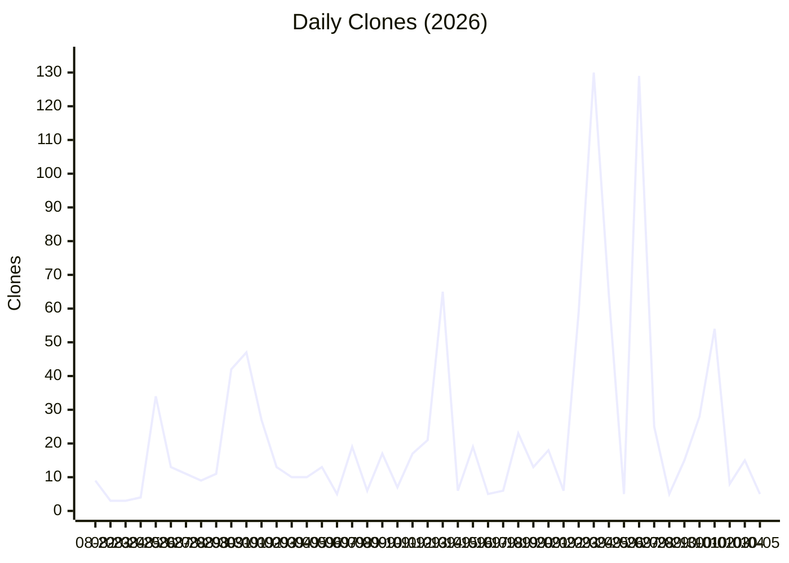
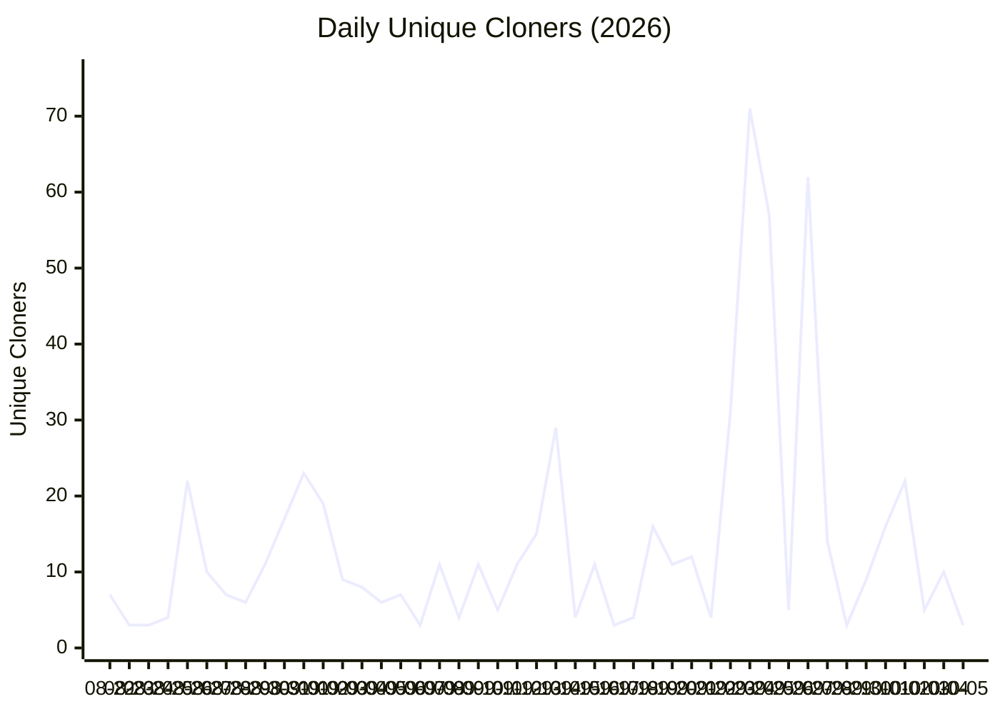
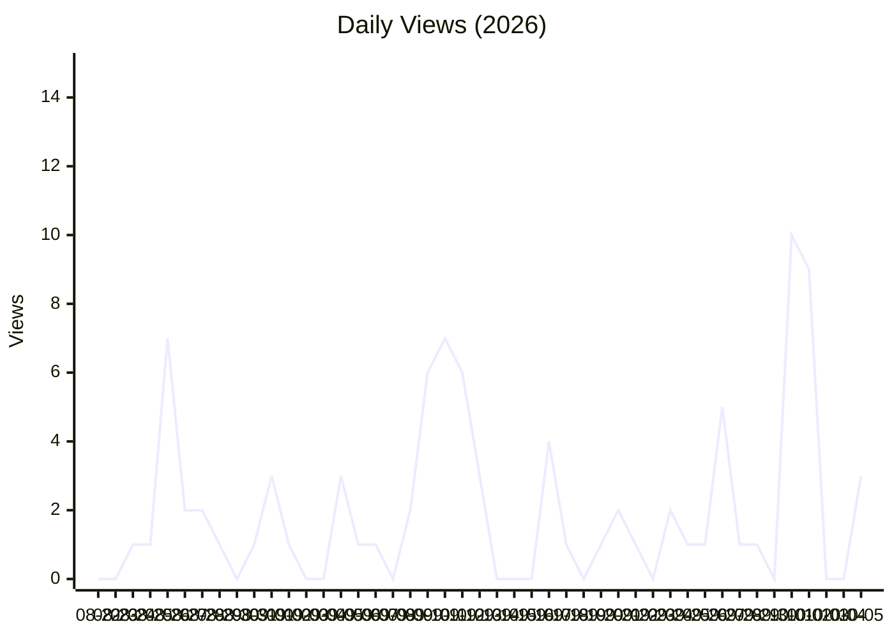
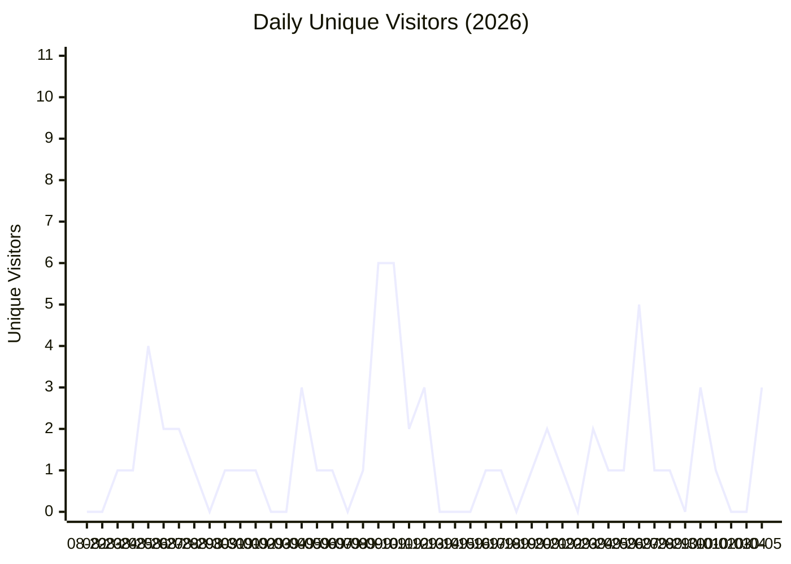

# Repository Traffic Report

**Last updated:** 2026-10-06T09:35:10 UTC

## Latest 14-day totals

- **Clones:** 548 total · 255 unique
- **Views:** 34 total · 14 unique

## Clones over time

```mermaid
xychart-beta
    title "Daily Clones (2026)"
    x-axis ["08-22", "08-23", "08-24", "08-25", "08-26", "08-27", "08-28", "08-29", "08-30", "08-31", "09-01", "09-02", "09-03", "09-04", "09-05", "09-06", "09-07", "09-08", "09-09", "09-10", "09-11", "09-12", "09-13", "09-14", "09-15", "09-16", "09-17", "09-18", "09-19", "09-20", "09-21", "09-22", "09-23", "09-24", "09-25", "09-26", "09-27", "09-28", "09-29", "09-30", "10-01", "10-02", "10-03", "10-04", "10-05"]
    y-axis "Clones" 0 --> 135
    line [9, 3, 3, 4, 34, 13, 11, 9, 11, 42, 47, 27, 13, 10, 10, 13, 5, 19, 6, 17, 7, 17, 21, 65, 6, 19, 5, 6, 23, 13, 18, 6, 59, 130, 64, 5, 129, 25, 5, 15, 28, 54, 8, 15, 5]
```

## Unique Cloners over time

```mermaid
xychart-beta
    title "Daily Unique Cloners (2026)"
    x-axis ["08-22", "08-23", "08-24", "08-25", "08-26", "08-27", "08-28", "08-29", "08-30", "08-31", "09-01", "09-02", "09-03", "09-04", "09-05", "09-06", "09-07", "09-08", "09-09", "09-10", "09-11", "09-12", "09-13", "09-14", "09-15", "09-16", "09-17", "09-18", "09-19", "09-20", "09-21", "09-22", "09-23", "09-24", "09-25", "09-26", "09-27", "09-28", "09-29", "09-30", "10-01", "10-02", "10-03", "10-04", "10-05"]
    y-axis "Unique Cloners" 0 --> 76
    line [7, 3, 3, 4, 22, 10, 7, 6, 11, 17, 23, 19, 9, 8, 6, 7, 3, 11, 4, 11, 5, 11, 15, 29, 4, 11, 3, 4, 16, 11, 12, 4, 31, 71, 57, 5, 62, 14, 3, 9, 16, 22, 5, 10, 3]
```

## Views over time

```mermaid
xychart-beta
    title "Daily Views (2026)"
    x-axis ["08-22", "08-23", "08-24", "08-25", "08-26", "08-27", "08-28", "08-29", "08-30", "08-31", "09-01", "09-02", "09-03", "09-04", "09-05", "09-06", "09-07", "09-08", "09-09", "09-10", "09-11", "09-12", "09-13", "09-14", "09-15", "09-16", "09-17", "09-18", "09-19", "09-20", "09-21", "09-22", "09-23", "09-24", "09-25", "09-26", "09-27", "09-28", "09-29", "09-30", "10-01", "10-02", "10-03", "10-04", "10-05"]
    y-axis "Views" 0 --> 15
    line [0, 0, 1, 1, 7, 2, 2, 1, 0, 1, 3, 1, 0, 0, 3, 1, 1, 0, 2, 6, 7, 6, 3, 0, 0, 0, 4, 1, 0, 1, 2, 1, 0, 2, 1, 1, 5, 1, 1, 0, 10, 9, 0, 0, 3]
```

## Unique Visitors over time

```mermaid
xychart-beta
    title "Daily Unique Visitors (2026)"
    x-axis ["08-22", "08-23", "08-24", "08-25", "08-26", "08-27", "08-28", "08-29", "08-30", "08-31", "09-01", "09-02", "09-03", "09-04", "09-05", "09-06", "09-07", "09-08", "09-09", "09-10", "09-11", "09-12", "09-13", "09-14", "09-15", "09-16", "09-17", "09-18", "09-19", "09-20", "09-21", "09-22", "09-23", "09-24", "09-25", "09-26", "09-27", "09-28", "09-29", "09-30", "10-01", "10-02", "10-03", "10-04", "10-05"]
    y-axis "Unique Visitors" 0 --> 11
    line [0, 0, 1, 1, 4, 2, 2, 1, 0, 1, 1, 1, 0, 0, 3, 1, 1, 0, 1, 6, 6, 2, 3, 0, 0, 0, 1, 1, 0, 1, 2, 1, 0, 2, 1, 1, 5, 1, 1, 0, 3, 1, 0, 0, 3]
```

## Recent daily numbers

| Date | Clones | Unique Cloners | Views | Unique Visitors |
|------|--------|----------------|-------|-----------------|
| 10-05 | 5 | 3 | 3 | 3 |
| 10-04 | 15 | 10 | 0 | 0 |
| 10-03 | 8 | 5 | 0 | 0 |
| 10-02 | 54 | 22 | 9 | 1 |
| 10-01 | 28 | 16 | 10 | 3 |
| 09-30 | 15 | 9 | 0 | 0 |
| 09-29 | 5 | 3 | 1 | 1 |
| 09-28 | 25 | 14 | 1 | 1 |
| 09-27 | 129 | 62 | 5 | 5 |
| 09-26 | 5 | 5 | 1 | 1 |
| 09-25 | 64 | 57 | 1 | 1 |
| 09-24 | 130 | 71 | 2 | 2 |
| 09-23 | 59 | 31 | 0 | 0 |
| 09-22 | 6 | 4 | 1 | 1 |
| 09-21 | 18 | 12 | 2 | 2 |
| 09-20 | 13 | 11 | 1 | 1 |
| 09-19 | 23 | 16 | 0 | 0 |
| 09-18 | 6 | 4 | 1 | 1 |
| 09-17 | 5 | 3 | 4 | 1 |
| 09-16 | 19 | 11 | 0 | 0 |
| 09-15 | 6 | 4 | 0 | 0 |
| 09-14 | 65 | 29 | 0 | 0 |
| 09-13 | 21 | 15 | 3 | 3 |
| 09-12 | 17 | 11 | 6 | 2 |
| 09-11 | 7 | 5 | 7 | 6 |
| 09-10 | 17 | 11 | 6 | 6 |
| 09-09 | 6 | 4 | 2 | 1 |
| 09-08 | 19 | 11 | 0 | 0 |
| 09-07 | 5 | 3 | 1 | 1 |
| 09-06 | 13 | 7 | 1 | 1 |

---
*Generated automatically by the traffic logging workflow.*